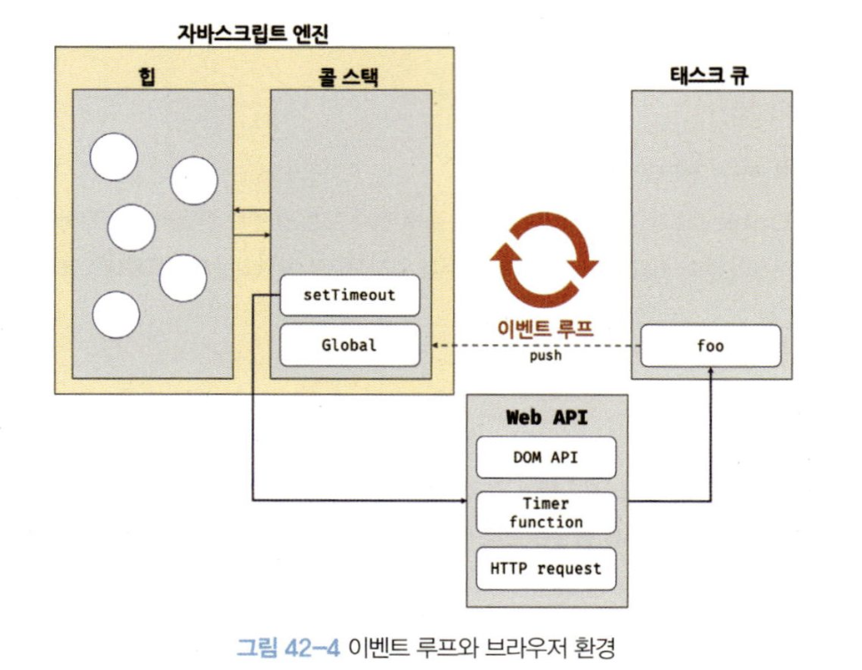

# 1. 동기 처리와 비동기 처리

함수를 호출하면 함수 코드가 평가되어 함수 실행 컨텍스트가 생성되고, 실행 컨텍스트 스택(콜 스택)에 푸시되어 코드가 실행된다.

함수 코드 실행이 종료되면 실행 컨텍스트는 스택에서 팝(pop)되어 제거된다.

자바스크립트 엔진은 **하나의 실행 컨텍스트 스택**을 가지며, 이는 **싱글 스레드(single thread)** 로 동작함을 의미한다.

👉🏻 즉, 한 번에 하나의 태스크만 실행할 수 있다1!

## 1-1. 동기(Synchronous) 처리

현재 실행 중인 태스크가 종료될 때까지 다음에 실행될 태스크가 대기하는 방식이다.

- 장점: 실행 순서가 보장된다.
- 단점: 앞선 태스크가 종료될 때까지 이후 태스크들이 **블로킹(blocking)** 된다.

```javascript
// sleep 함수 (동기 처리의 예)
function sleep(func, delay) {
  const delayUntil = Date.now() + delay
  while (Date.now() < delayUntil);
  func()
}

function foo() {
  console.log('foo')
}

function bar() {
  console.log('bar')
}

// sleep 함수 때문에 3초간 블로킹된다.
sleep(foo, 3000)
bar()
```

[화면 기록 2025-07-11 오후 5.01.36](./화면%20기록%202025-07-11%20오후%205.01.36.mov)

## 1-2. 비동기(Asynchronous) 처리

현재 실행 중인 태스크가 종료되지 않은 상태여도 다음 태스크를 곧바로 실행하는 방식이다.

- 장점: **블로킹이 발생하지 않는다.**
- 단점: 태스크의 실행 순서가 보장되지 않는다.

EX) `setTimeout`, `setInterval`, HTTP 요청, 이벤트 핸들러 등이 비동기 방식으로 동작함!

```javascript
function foo() {
  console.log('foo')
}

function bar() {
  console.log('bar')
}

// setTimeout은 bar 함수를 블로킹하지 않는다.
setTimeout(foo, 3000) // 3초 후에 foo가 실행되도록 스케줄링
bar() // 즉시 실행된다.

// 출력 순서: bar -> (3초 후) -> foo
```

[화면 기록 2025-07-11 오후 5.03.56](./화면%20기록%202025-07-11%20오후%205.03.56.mov)

# 2. 이벤트 루프와 태스크 큐

자바스크립트의 동시성(concurrency)을 지원하는 것이 바로 **이벤트 루프(event loop)**

이벤트 루프는 브라우저에 내장된 기능 중 하나이다.



## 2-1. 자바스크립트 엔진의 구성 요소

1. **콜 스택(Call Stack)**  
   함수 호출 시 생성되는 실행 컨텍스트를 저장하는 스택으로,코드가 실행되는 공간이다.

2. **힙(Heap)**
   객체가 저장되는 메모리 공간으로, 콜 스택의 실행 컨텍스트는 힙에 저장된 객체를 참조합니다.

> 🤓 자바스크립트 엔진은 요청된 코드를 콜 스택을 통해 순차적으로 실행할 뿐이다.
>
> 비동기 처리는 브라우저 또는 Node.js가 담당한다.

## 2-2. 브라우저 환경의 구성 요소

- **Web API**
  `setTimeout`, `DOM API`, `HTTP 요청(Ajax)` 등 브라우저에서 제공하는 API이다.
  비동기 작업을 처리한다.

- **태스크 큐(Task Queue / Event Queue)**
  `setTimeout`의 콜백 함수나 이벤트 핸들러 등 비동기 처리된 함수의 콜백이 일시적으로 대기하는 큐(FIFO 방식)

- **이벤트 루프(Event Loop)**
  1.  콜 스택이 비어 있는지 계속 확인하고
  2.  콜 스택이 비어 있다면, 태스크 큐에 대기 중인 함수를 순서대로 꺼내 콜 스택으로 이동시킨다.
  3.  콜 스택으로 이동된 함수는 실행된다.

## 2-3. 비동기 처리 동작 방식 (setTimeout 예시)

1.  `setTimeout(foo, 0)`이 호출되면, `setTimeout` 함수 자체는 콜 스택에 푸시되었다가 바로 팝 된다.
2.  동시에 브라우저의 Web API인 타이머에게 타이머 설정을 요청하고
3.  Web API는 지정된 시간(0초, 실제로는 최소 4ms)을 기다린 후, 콜백 함수 `foo`를 **태스크 큐**에 푸시한다.
4.  다른 동기 코드(예: `bar()`)가 모두 실행되고 콜 스택이 완전히 비워진다.
5.  **이벤트 루프**가 콜 스택이 비었음을 감지하고, 태스크 큐에 있던 `foo` 함수를 콜 스택으로 푸시한다.
6.  `foo` 함수가 실행된다.

> 🤓 이처럼 `setTimeout`의 콜백 함수는 **콜 스택이 비워진 후에야** 실행되므로, `delay` 시간이 정확히 보장되지 않을 수 있다.

### 자바스크립트는 싱글 스레드로 동작하지만, 브라우저는 멀티 스레드로 동작한다!
