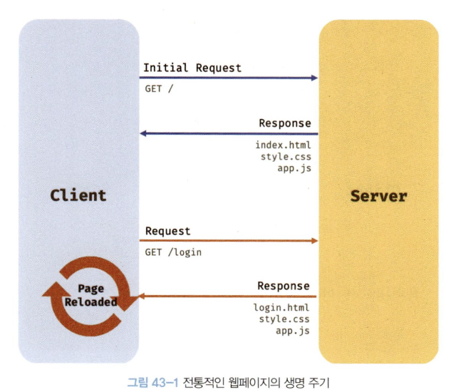
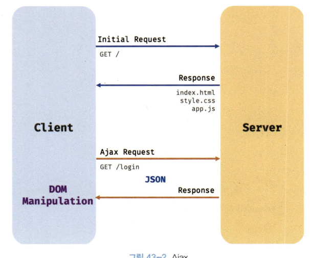

# 1. Ajax란?

**Ajax(Asynchronous JavaScript and XML)** 란 자바스크립트를 사용하여 브라우저가 서버에게 비동기 방식으로 데이터를 요청하고, 서버가 응답한 데이터를 수신하여 웹페이지를 동적으로 갱신하는 프로그래밍 방식을 말한다.

Ajax는 브라우저에서 제공하는 Web API인 `XMLHttpRequest` 객체를 기반으로 동작한다.

### 전통적인 방식과 Ajax 방식의 비교

- **전통적인 방식**

  1.  변경할 필요가 없는 부분까지 포함된 완전한 HTML을 서버로부터 매번 다시 전송받아 불필요한 데이터 통신이 발생한다.
  2.  화면 전환 시 전체를 다시 렌더링하여 화면이 순간적으로 깜박이는 현상이 발생한다.
  3.  동기 방식으로 동작하여 서버의 응답이 있을 때까지 다음 처리가 블로킹된다.

  

- **Ajax 방식**

  1.  변경에 필요한 데이터만 비동기 방식으로 전송받아 불필요한 데이터 통신이 발생하지 않는다.
  2.  변경이 필요한 부분만 한정적으로 렌더링하여 화면 깜박임 현상이 없다.
  3.  비동기 방식으로 동작하여 블로킹이 발생하지 않는다.

  

# 2. JSON

**JSON(JavaScript Object Notation)** 은 클라이언트와 서버 간의 HTTP 통신을 위한 텍스트 데이터 포맷이다.

언어 독립형 데이터 포맷으로 대부분의 프로그래밍 언어에서 사용할 수 있다.

## 2-1. JSON 표기 방식

키와 값으로 구성된 순수한 텍스트다.

키는 반드시 큰따옴표로 묶어야 한다.

문자열 값도 반드시 큰따옴표로 묶어야 한다.

## 2-2. `JSON.stringify`

객체 또는 배열을 JSON 포맷의 문자열로 변환한다. (직렬화, `serializing`)

클라이언트가 서버로 데이터를 전송할 때 사용한다.

```javascript
const obj = { name: 'Hazel', age: 22 }
const jsonString = JSON.stringify(obj) // '{"name":"Hazel","age":22}'
```

## 2-3. `JSON.parse`

JSON 포맷의 문자열을 객체 또는 배열로 변환한다. (역직렬화, `deserializing`)

서버로부터 전송받은 데이터를 자바스크립트에서 사용하기 위해 필요하다.

```javascript
const jsonString = '{"name":"Hazel","age":22}'
const obj = JSON.parse(jsonString) // { name: 'Hazel', age: 22 }
```

# 3. XMLHttpRequest

자바스크립트를 사용하여 HTTP 요청을 전송하려면 `XMLHttpRequest` 객체를 사용한다.

이 객체는 HTTP 요청 전송과 응답 수신을 위한 다양한 메서드와 프로퍼티를 제공한다.

## 3-1. `XMLHttpRequest` 객체 생성

`XMLHttpRequest` 생성자 함수를 호출하여 생성한다.

```javascript
const xhr = new XMLHttpRequest()
```

## 3-2. `XMLHttpRequest` 객체의 프로퍼티와 메서드

- **주요 프로퍼티**

  - `readyState` <br />
    HTTP 요청의 현재 상태를 나타내는 정수 (0: UNSENT, 1: OPENED, 2: HEADERS_RECEIVED, 3: LOADING, 4: DONE)
  - `status` <br />
    HTTP 요청에 대한 응답 상태 코드 (예: 200, 404, 500)
  - `statusText` <br />
    응답 메시지 (예: "OK")
  - `response` <br />
    응답 몸체(response body)
  - `responseText` <br />
    서버가 전송한 문자열 응답

- **주요 이벤트 핸들러**

  - `onreadystatechange` <br />
    `readyState` 프로퍼티 값이 변경될 때마다 발생
  - `onload` <br />
    요청이 성공적으로 완료되었을 때 발생
  - `onerror` <br />
    요청에 에러가 발생했을 때 발생

- **주요 메서드**
  - `open(method, url, [async])` <br />
    HTTP 요청을 초기화한다.
  - `send([body])` <br />
    HTTP 요청을 전송한다.
  - `setRequestHeader(key, value)` <br />
    특정 HTTP 요청 헤더의 값을 설정한다.

## 3-3. HTTP 요청 전송

1.  `open` 메서드로 요청을 초기화한다.
2.  필요에 따라 `setRequestHeader` 메서드로 헤더 값을 설정한다.
3.  `send` 메서드로 요청을 전송한다.

```javascript
// 1. 객체 생성
const xhr = new XMLHttpRequest()

// 2. 요청 초기화
xhr.open('GET', 'https://jsonplaceholder.typicode.com/todos/1')

// 3. 헤더 설정 (필요시)
xhr.setRequestHeader('Content-Type', 'application/json')

// 4. 요청 전송
xhr.send()
```

## 3-4. HTTP 응답 처리

`XMLHttpRequest` 객체가 발생시키는 이벤트를 캐치하여 응답을 처리한다.

`readystatechange` 또는 `load` 이벤트를 주로 사용한다.

```javascript
// load 이벤트 핸들러 사용
xhr.onload = () => {
  if (xhr.status === 200) {
    // 정상 응답
    console.log(JSON.parse(xhr.response))
  } else {
    // 에러 발생
    console.error('Error', xhr.status, xhr.statusText)
  }
}
```
