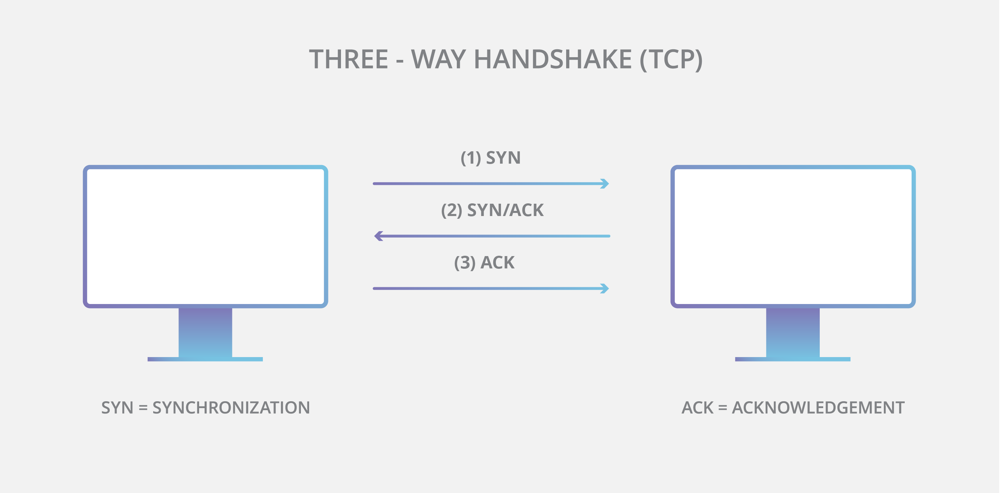
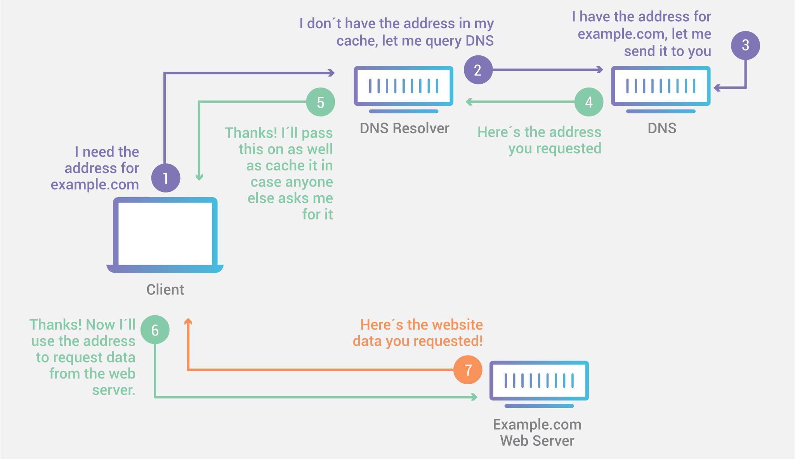
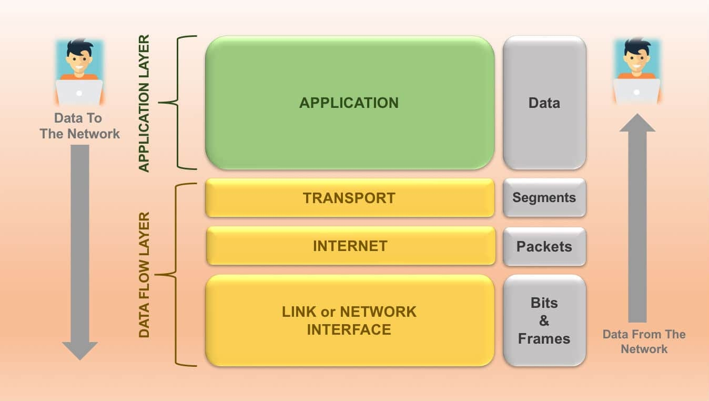
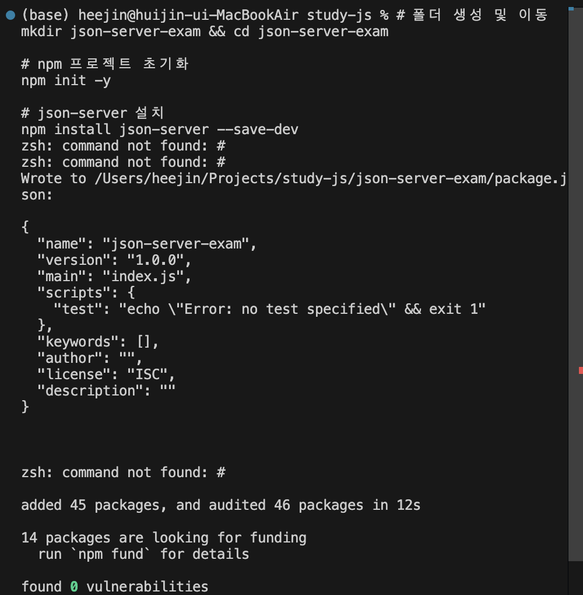
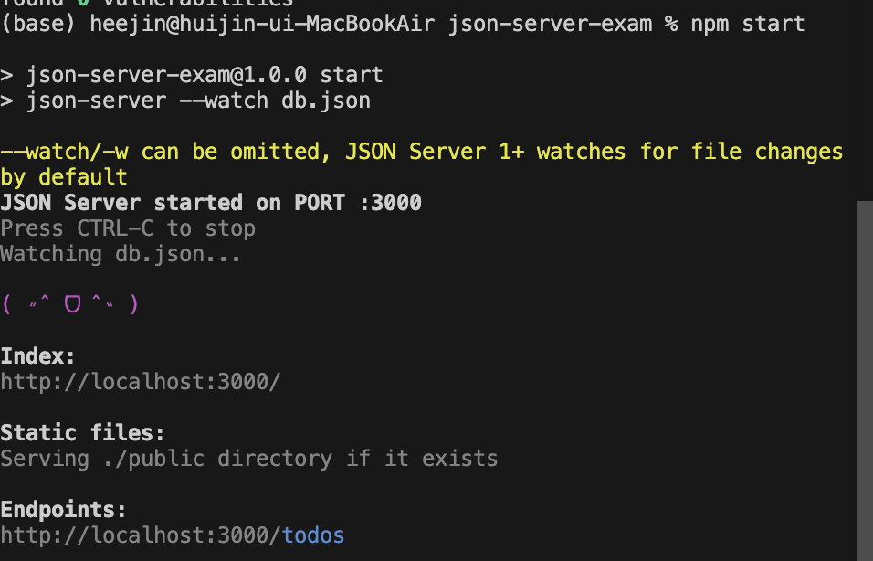
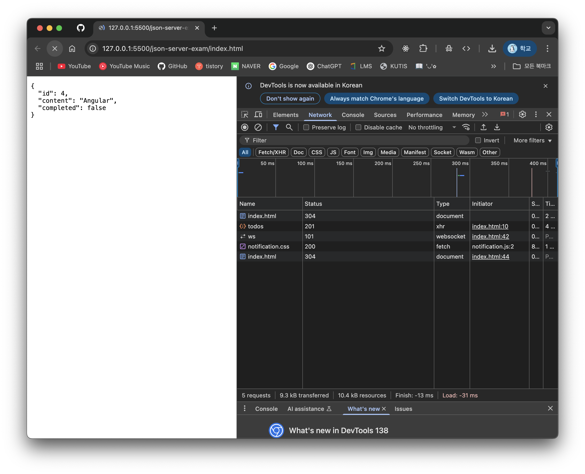
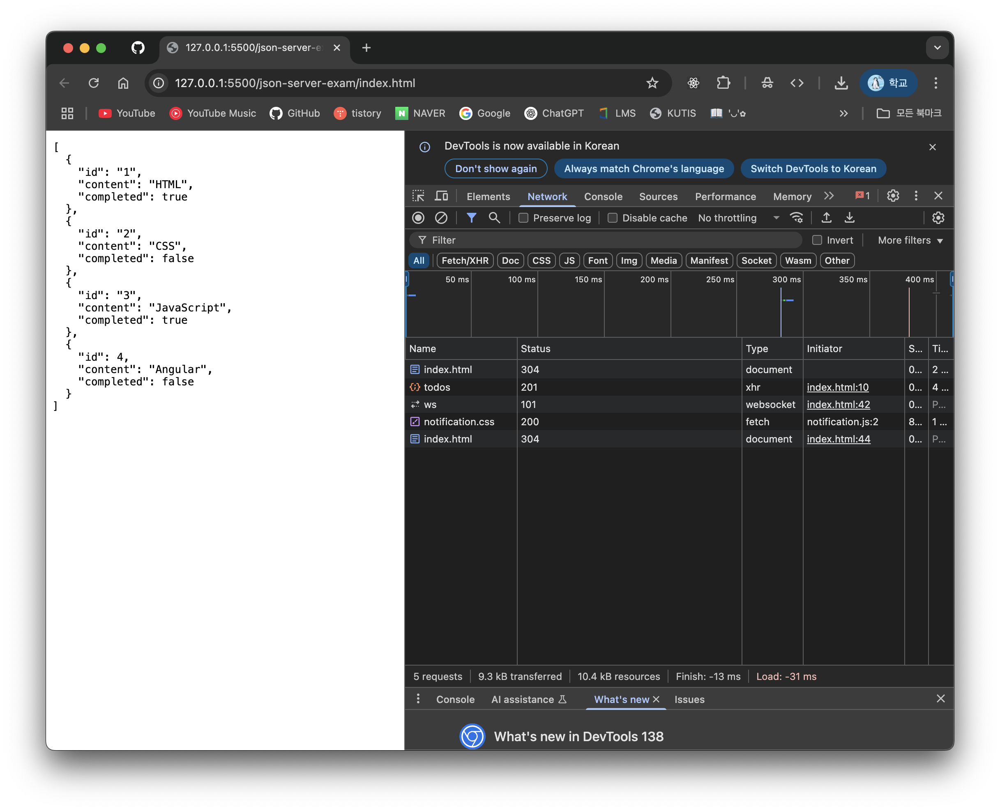
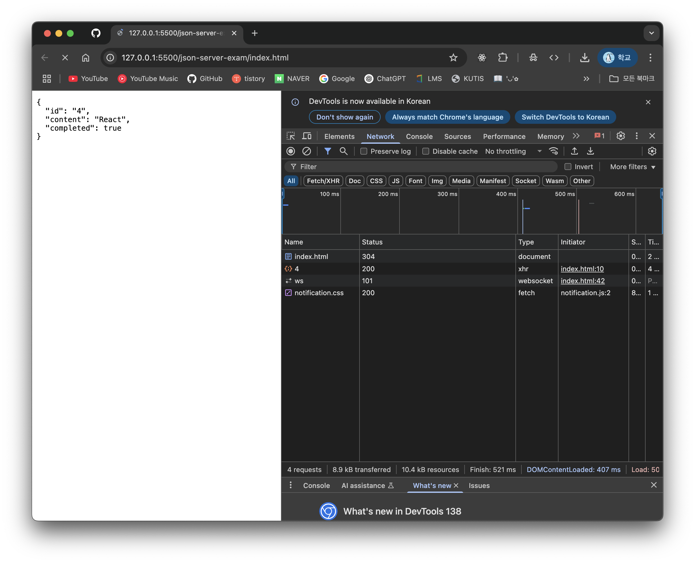
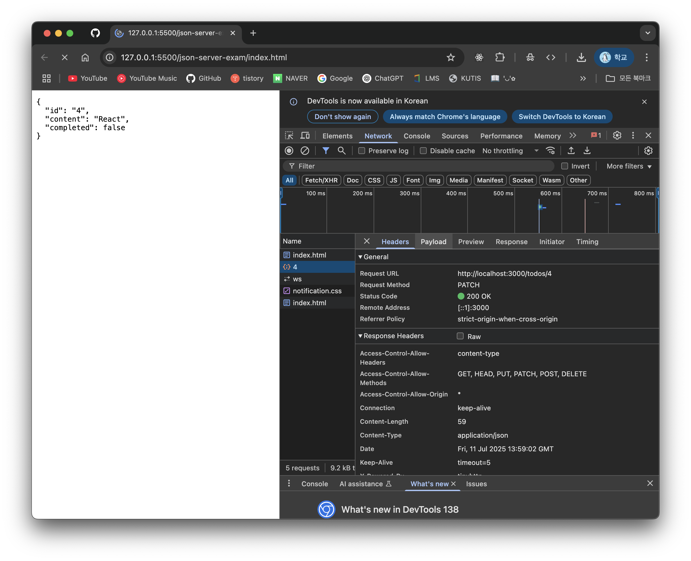

# 1. REST API란?

REST(Representational State Transfer)는 HTTP/1.0과 1.1의 스펙 작성에 참여했고, 아파치 HTTP 서버 프로젝트의 공동 설립자인 로이 필딩(Roy Fielding)의 2000년 논문에서 처음 소개되었다.

REST는 HTTP를 기반으로 클라이언트가 서버의 리소스에 접근하는 방식을 규정한 아키텍처이고, REST API는 REST를 기반으로 서비스 API를 구현한 것을 의미한다.

REST의 기본 원칙을 성실히 지킨 서비스 디자인을 "RESTful"이라고 표현한다.

### REST API의 구성 요소

REST API는 **자원(Resource)**, **행위(Verb)**, **표현(Representations)**의 3가지 요소로 구성된다.

| 구성 요소                 | 내용                           | 표현 방법         |
| ------------------------- | ------------------------------ | ----------------- |
| **자원(Resource)**        | 자원                           | URI(엔드포인트)   |
| **행위(Verb)**            | 자원에 대한 행위               | HTTP 요청 메서드  |
| **표현(Representations)** | 자원에 대한 행위의 구체적 내용 | 페이로드(Payload) |

# 2 REST API 설계 원칙

1. **URI는 리소스를 표현해야 한다.**
   - URI는 리소스를 표현하는 데 중점을 두어야 한다. 리소스 식별에는 동사보다 명사를 사용한다.
   - `GET /getTodos/1` (X)
   - `GET /todos/1` (O)

<br />

2. **리소스에 대한 행위는 HTTP 요청 메서드로 표현한다.**
   - HTTP 요청 메서드는 클라이언트가 서버에게 요청의 종류와 목적(리소스에 대한 행위)을 알리는 방법이다.
   - 주로 5가지 요청 메서드(GET, POST, PUT, PATCH, DELETE 등)를 사용하여 CRUD를 구현한다.

| HTTP 요청 메서드 | 종류           | 목적                  | 페이로드 |
| ---------------- | -------------- | --------------------- | -------- |
| **GET**          | index/retrieve | 모든/특정 리소스 취득 | X        |
| **POST**         | create         | 리소스 생성           | O        |
| **PUT**          | replace        | 리소스의 전체 교체    | O        |
| **PATCH**        | modify         | 리소스의 일부 수정    | O        |
| **DELETE**       | delete         | 모든/특정 리소스 삭제 | X        |

# 3. TCP/IP

TCP/IP는 인터넷을 통해 컴퓨터들이 서로 정보를 주고받는 데 사용되는 통신 프로토콜의 모음이다.

TCP와 IP가 가장 중요한 역할을 하므로 TCP/IP라는 이름이 붙었다.

### TCP (Transmission Control Protocol)



- **연결 지향 프로토콜**: 데이터를 전송하기 전에 먼저 상대방과 연결을 설정한다.
- **신뢰성 보장**: 데이터가 순서대로, 오류 없이, 중복되지 않게 전송되는 것을 보장한다. 데이터가 손실되면 재전송을 요청한다.
- **흐름 제어**: 송신 측과 수신 측의 데이터 처리 속도 차이를 조절하여 데이터가 넘쳐나지 않도록 한다.
- **혼잡 제어**: 네트워크의 혼잡 상태를 파악하고, 전송 속도를 조절하여 네트워크가 마비되는 것을 방지한다.

### IP (Internet Protocol)



- **비연결 지향 프로토콜**: 데이터를 전송할 때마다 각각의 데이터 조각(패킷)을 독립적으로 처리한다.
- **주소 지정**: 각 컴퓨터에 고유한 IP 주소를 할당하여, 데이터를 목적지까지 찾아갈 수 있도록 경로를 설정(라우팅)한다.
- **최선형 서비스**: 데이터 전송의 신뢰성을 보장하지 않는다. 패킷이 순서대로 도착하지 않거나, 유실될 수도 있다. (신뢰성은 TCP가 보장)

### TCP/IP 4계층 모델

TCP/IP는 보통 4개의 계층으로 설명된다.



1.  **애플리케이션 계층 (Application Layer)**
    사용자와 가장 가까운 계층으로, HTTP, FTP, SMTP 등 특정 서비스를 제공하는 프로토콜이 동작한다. (REST API는 이 계층에 속한다)
2.  **전송 계층 (Transport Layer)**
    송신자와 수신자를 연결하고 데이터 전송을 담당한다. TCP와 UDP가 대표적인 프로토콜이다.
3.  **인터넷 계층 (Internet Layer)**
    데이터 패킷을 목적지까지 전송하는 역할을 한다. IP 프로토콜이 이 계층에서 동작하며, 경로를 설정(라우팅)한다.
4.  **네트워크 인터페이스 계층 (Network Interface Layer)**
    물리적인 네트워크(이더넷, Wi-Fi 등)를 통해 데이터를 실제로 전송하는 역할을 한다.

> 🤓 **REST API와 TCP/IP**
>
> REST API는 HTTP 프로토콜 위에서 동작한다. HTTP는 TCP/IP의 애플리케이션 계층 프로토콜이다. 따라서 클라이언트가 REST API를 호출하면, 그 요청은 TCP/IP 스택을 통해 서버로 전송되고, 서버의 응답 또한 같은 경로를 통해 클라이언트로 돌아온다.
>
> 1.  **클라이언트**: `GET /todos/1` 요청 생성
> 2.  **HTTP**: 요청 메시지를 만듦
> 3.  **TCP**: HTTP 메시지를 세그먼트로 나누고, 신뢰성 있는 전송을 위해 헤더를 붙임
> 4.  **IP**: TCP 세그먼트를 패킷으로 만들고, 목적지 IP 주소를 붙여 전송
> 5.  **서버**: 역순으로 패킷을 받아 요청을 처리하고, 응답을 다시 TCP/IP 스택을 통해 클라이언트로 보낸다.

# 4. JSON Server를 이용한 REST API 실습

JSON Server는 `db.json` 파일을 사용하여 가상 REST API 서버를 구축할 수 있는 도구이다.

## 4-1. JSON Server 설치 및 실행

```bash
# 폴더 생성 및 이동
mkdir json-server-exam && cd json-server-exam

# npm 프로젝트 초기화
npm init -y

# json-server 설치
npm install json-server --save-dev
```



## 4-2. db.json 파일 생성

프로젝트 루트에 `db.json` 파일을 만들고, 아래와 같이 데이터를 채운다. 이 파일이 데이터베이스 역할을 한다.

```json
{
  "todos": [
    { "id": 1, "content": "HTML", "completed": true },
    { "id": 2, "content": "CSS", "completed": false },
    { "id": 3, "content": "JavaScript", "completed": true }
  ]
}
```

## 4-3. JSON Server 실행

`package.json` 파일의 `scripts` 부분을 수정하여 실행 명령어를 추가한다.

```json
"scripts": {
  "start": "json-server --watch db.json"
},
```

이제 터미널에서 아래 명령어로 서버를 실행할 수 있다.

```bash
npm start
```



## 4-4. GET 요청

`XMLHttpRequest` 객체를 사용하여 `todos` 리소스에서 모든 todo를 가져온다.

```html
<!DOCTYPE html>
<html>
  <body>
    <pre></pre>
    <script>
      const xhr = new XMLHttpRequest()
      xhr.open('GET', 'http://localhost:3000/todos')
      xhr.send()

      xhr.onload = () => {
        if (xhr.status === 200) {
          document.querySelector('pre').textContent = xhr.response
        } else {
          console.error('Error', xhr.status, xhr.statusText)
        }
      }
    </script>
  </body>
</html>
```


## 4-5. POST 요청

새로운 todo를 생성한다. `setRequestHeader`로 페이로드의 MIME 타입을 지정해야 한다.

```html
<!DOCTYPE html>
<html>
  <body>
    <pre></pre>
    <script>
      const xhr = new XMLHttpRequest()
      xhr.open('POST', 'http://localhost:3000/todos')

      xhr.setRequestHeader('content-type', 'application/json')
      xhr.send(JSON.stringify({ id: 4, content: 'Angular', completed: false }))

      xhr.onload = () => {
        if (xhr.status === 200 || xhr.status === 201) {
          document.querySelector('pre').textContent = xhr.response
        } else {
          console.error('Error', xhr.status, xhr.statusText)
        }
      }
    </script>
  </body>
</html>
```




## 4-6. PUT 요청

특정 리소스 전체를 교체한다.

```html
<!DOCTYPE html>
<html>
  <body>
    <pre></pre>
    <script>
      const xhr = new XMLHttpRequest()
      xhr.open('PUT', 'http://localhost:3000/todos/4')

      xhr.setRequestHeader('content-type', 'application/json')
      xhr.send(JSON.stringify({ id: 4, content: 'React', completed: true }))

      xhr.onload = () => {
        if (xhr.status === 200) {
          document.querySelector('pre').textContent = xhr.response
        } else {
          console.error('Error', xhr.status, xhr.statusText)
        }
      }
    </script>
  </body>
</html>
```



## 4-7. PATCH 요청

특정 리소스의 일부를 수정한다.

```html
<!DOCTYPE html>
<html>
  <body>
    <pre></pre>
    <script>
      const xhr = new XMLHttpRequest()
      xhr.open('PATCH', 'http://localhost:3000/todos/4')
      xhr.setRequestHeader('content-type', 'application/json')
      xhr.send(JSON.stringify({ completed: false }))

      xhr.onload = () => {
        if (xhr.status === 200) {
          document.querySelector('pre').textContent = xhr.response
        } else {
          console.error('Error', xhr.status, xhr.statusText)
        }
      }
    </script>
  </body>
</html>
```



## 4-8. DELETE 요청

특정 리소스를 삭제한다.

```html
<!DOCTYPE html>
<html>
  <body>
    <pre></pre>
    <script>
      const xhr = new XMLHttpRequest()
      xhr.open('DELETE', 'http://localhost:3000/todos/4')
      xhr.send()

      xhr.onload = () => {
        if (xhr.status === 200) {
          document.querySelector('pre').textContent = xhr.response
        } else {
          console.error('Error', xhr.status, xhr.statusText)
        }
      }
    </script>
  </body>
</html>
```

너무 빨리 데이터가 삭제돼서 못찌금...
