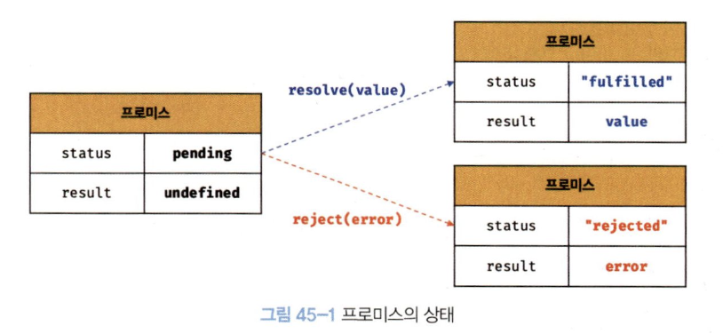

JS는 비동기 처리를 위한 패턴으로 콜백 함수를 사용하는데,

콜백 헬이 만들어지면 가독성이 좋지 않고

에러 처리가 곤란해지는 한계가 발생한다.

따라서 ES6에서는 비동기 처리를 위한 또 다른 패턴으로 프로미스가 도입되었다.

이는 이전의 콜백 패턴의 단점을 보완하며, 비동기 처리 시점을 명확하게 표현할 수 있는 장점이 있다.

# 1. 비동기 처리를 위한 콜백 패턴의 단점

GET같은 비동기 함수는 호출하면

내부의 비동기 코드가 완료되기 전에 함수가 종료되기 때문에

내부의 비동기 코드 처리 결과를 외부로 반환하거나 상위 스코프의 변수에 할당하면 기대한 대로 동작하지 않을 수 있다.

따라서! 비동기 함수는 “당장” 결과를 반환할 수 없다. ex) setTimeout(), GET 함수 등

그래서 비동기 결과를 기다려서 받을 수 있는 콜백, Promise, async/await가 등장한 거시다.

## 1-1. 비동기 GET 요청 예시

```jsx
let todos

const get = (url) => {
  const xhr = new XMLHttpRequest()
  xhr.open('GET', url)
  xhr.send()

  // 서버 응답이 도착하면 실행될 콜백
  xhr.onload = () => {
    todos = JSON.parse(xhr.response) // (1) 여기서 응답 데이터를 변수에 저장
  }
}

get('https://jsonplaceholder.typicode.com/posts/1')
console.log(todos) // (2) 근데 여기선 undefined 출력됨
```

1. **`get` 함수 호출**

   내부 코드가 동작하면서 HTTP 요청을 보낸다.

   그리고 xhr.onload = () ⇒ {…} 로 콜백 함수를 등록해준다.

   근데 이건 나중에 서버 응답이 도착하면 실행될 콜백으로, get 함수는 곧바로 `undefined`를 반환한다.

2. **`console.log(todos)` 실행**

   `get` 함수가 끝나자마자 실행된다.

   그래서 아직 서버 응답이 오지 않은 상태고 (`xhr.onload`)도 호출되지 않았고

   todos는 여전히 `undefined`인 상태이다.

3. 서버 응답 도착

   잠시 후 서버에서 응답이 도착하면 `load 이벤트`가 발생한다.

   이때 브라우저는 `xhr.onload`에 등록해둔 콜백 함수를 **Task Queue**에 등록한다.

   그리고 브라우저는 현재 실행 중인 코드가 전부 끝나고, 이 콜백을 실행한다.

4. 콜 스택이 비면, 이벤트 핸들러를 실행

   브라우저에 **콜 스택**이 비었나 확인하고, `xhr.onload`를 실행한다.

   그러면 todos 변수에 응답 값이 할당된다.

## 1-3. 에러 처리의 한계

```jsx
try {
	setTimeout(() -> { throw new Error('Error!'); 1000}, 1000);
} catch (e) {
	// 에러를 캐치하지 못한다.
	console.error('캐치한 에러', e);
}
```

setTimeout의 결과가 1초 뒤에 나오기 때문에 catch 문에서 캐치되지 않는다.

동작 과정은 다음과 같다.

1. setTimeout이 Call Stack에 푸시
2. setTimeout이 종료 (Call Stack에서 팝)
3. setTimeout의 콜백 함수가 Task Queue로 푸시
4. Call Stask이 비었을 때 Event Loop로 의해 Call Stack으로 푸시되어 실행됨

> 🤓 에러는 호출자 방향으로 전파되는데,
>
> 콜백 함수가 실행되는 시점에서 Call Stack에 setTimeout이 없으니까
>
> 콜백 함수의 호출자가 존재하지 않는 셈이다.

# 2. 프로미스의 생성

ES6에서 도입된 Promise는 호스트 객체가 아닌 ECMAScript 사양에 정의된 표준 빌트인 객체이다.

비동기 처리를 수행할 콜백 함수를 인수로 받고, 콜백 함수는 resolve, reject 함수를 인수로 전달받는다.

비동기 처리가 성공하면 resolve 함수를 호출하고, 실패하면 reject 함수를 호출한다.

프로미스는 3가지의 상태 정보를 가진다.

1. `pending`: 비동기 처리 수행 중
2. `fulfilled`: 비동기 처리 성공, `resolved` 함수 호출
3. `rejected`: 비동기 처리 실패, `reject` 함수 호출



fulfilled, rejected 상태는 settled 상태라고 한다.

settled 상태가 되면 다른 상태로 변화할 수 없다.

```jsx
const fulfilled = new Promise((resolve) => resolve(1))
```


```jsx
const rejected = new Promise((_, reject) => reject(new Error('error occurred')))
```


# 3. 프로미스의 후속 처리 메서드

프로미스의 비동기 처리 상태가 변화하면 이에 따른 후속 처리를 해야 한다.

이를 위해 프로미스는 후속 메서드 `then`, `catch`, `finally`를 제공한다.

## 3-1. `Promise.prototype.then`

두 개의 콜백 함수를 인수로 받는다.

첫 번째 콜백 함수는 `fultilled` 상태가 되면 호출된다. 이때 콜백 함수는 프로미스의 **비동기 처리 결과**를 인수로 전달받는다.

두 번째 콜백 함수는 `rejected` 상태가 되면 호출된다. 이때 콜백 함수는 프로미스의 **에러**를 인수로 전달받는다.

> 🤓 다만, 두 번째 콜백 함수를 전달하는 것보다 `catch` 메서드를 사용하는 것이 가독성이 좋고 명확하기 때문에
>
> 에러 처리는 `catch` 메서드에서 하는 것이 권장된다!

## 3-2. `Promise.prototype.catch`

한 개의 콜백 함수를 인수로 전달받는다.

프로미스가 `rejected` 상태인 경우만 호출된다.

## 3-3. `Promise.prototype.finally`

한 개의 콜백 함수를 인수로 전달받는다.

프로미스의 성공/실패와 상관없이 **무조건 한 번 호출된다.**

프로미스의 상태와 상관없이 공통으로 처리해야 할 내용이 있을 때 유용하다.

> 🤓 모두 항상 프로미스를 반환한다.

# 4. 프로미스 체이닝

기존에는 이렇게 복잡했던 코드를!!!1

```jsx
const get = (url, callback) => {
  const xhr = new XMLHttpRequest()
  xhr.open('GET', url)
  xhr.send()

  xhr.onload = () => {
    if (xhr.status === 200) {
      callback(JSON.parse(xhr.response))
    } else {
      console.error(`${xhr.status} ${xhr.statusText}`)
    }
  }
}

const url = 'https://어쩌구저쩌구'

get(`${url}/posts/1`, ({ userId }) => {
  console.log(userId)

  get(`${url}/users/${userId}`, (userInfo) => {
    console.log(userInfo)
  })
})
```

이렇게 간단하게 만들 수 있다 ^\_\_^

그리고 후속 처리를 연속으로 하는 것을 **프로미스 체이닝(Promise chaining)**이라고 한다.

```jsx
const url = 'https://어쩌구저쩌구'

promiseGet(`${url}/posts/1`)
  .then(({ userId }) => promiseGet(`${url}/users/${userId}`))
  .then((userInfo) => console.log(userInfo))
  .catch((err) => console.error(err))
```

> 🤓 프로미스를 사용함으로써 콜백 헬은 발생하지 않지만,
>
> 프로미스도 콜백 패턴을 사용하므로, 콜백 함수를 사용하지 않는 것은 아니다.
>
> 근데 요 콜백 패턴도 가독성은 좋지 않아서
>
> 후에 ES8에서 도입된 `async/await`를 통해 해결할 수 있다. ^\_\_^

# 5. 프로미스 정적 메서드

## 5-1. `Promise.resolve`/`Promise.reject`

이미 존재하는 값을 래핑하여 프로미스를 생성하기 위해 사용한다.

### 5-1-1. `Promise.resolve`

인수로 전달받은 값을 `resolve`하는 프로미스를 생성한다.

```jsx
// const resolvedPromist = new Promise(resolve => resolve([1, 2, 3]));
const resolvedPromise = Promise.resolve([1, 2, 3])
resolvedPromise.then(console.log) // [1, 2, 3]
```

### 5-1-2. `Promise.reject`

인수로 전달받은 값을 `reject`하는 프로미스를 생성한다.

```jsx
// const rejectedPromise = new Promise((_, reject) => reject(new Error('Error!')));
const rejectedPromise = Promise.reject(new Error('Error!'))
rejectedPromise.catch(console.log) // Error: Error!
```

## 5-2. `Promise.all`

여러 개의 비동기 처리를 모두 병렬 처리할 때 사용한다.

```jsx
const r1 = () => new Promise(resolve => ...));
const r2 = () => new Promise(resolve => ...));
const r3 = () => new Promise(resolve => ...));

Promise.all([r1(), r2(), r3()])
	.then(...)
	.catch(console.error);
```

전달 받은 모든 프로미스가 `fulfilled` 상태가 되면 처리 결과를 배열에 저장해 새로운 프로미스를 반환한다.

하나라도 `rejected` 상태가 되면 즉시 종료한다.

따라서 가장 먼저 `rejected` 된 프로미스의 메서드가 `catch`에서 잡힌다.

## 5-3. `Promise.race`

`Promise.all` 같은 앤데, 모든 프로미스가 `fulfilled` 상태가 되기를 기다리는 것이 아니라

**가장 먼저 `fulfilled` 상태가 된 프로미스의 처리 결과를 `resolve` 하는 새로운 프로미스를 반환**한다.

```jsx
const r1 = () => new Promise((resolve) => setTimeout(() => resolve(1), 3000))
const r2 = () => new Promise((resolve) => setTimeout(() => resolve(2), 2000))
const r3 = () => new Promise((resolve) => setTimeout(() => resolve(3), 1000))

Promise.all([r1(), r2(), r3()])
  .then(console.log) // 3
  .catch(console.error)
```

하나라도 rejected 되면 즉시 종료되며, 해당 에러를 reject하는 새로운 프로미스를 즉시 반환한다.

## 5-4. `Promise.allSettled`

얘도 여러 개의 프로미스를 인수로 전달받는데,

모두 settled 상태가 되면 처리 결과를 반환한다.

resolve를 반환할 수도 있고, reject를 반환할 수도 있다.

# 6. Microtask Queue

```jsx
setTimeout(() => console.log(1), 0); // 3번째로 실행

Promise.resolve()
	.then(() => console.log(2)); // 1번째로 실행
	.then(() => console.log(3)); // 2번째로 실행
```

프로미스의 후속 처리 메서드의 콜백 함수는 **Microtask Queue**에 저장된다.

이는 Task Queue와는 별도의 큐로, Task Queue보다 우선순위가 높다.

# 7. fetch

`fetch` 함수는 `XMLHttpRequest` 객체보다 **사용법이 간단**하고 **프로미스를 지원**하기 때문에 비동기 처리를 위한 콜백 패턴의 단점에서 자유롭다.

`fetch` 함수에는

**HTTP 요청을 전송할 url**,

**HTTP 요청 메서드**,

**HTTP 요청 헤더**,

**페이로드** 등을 설정한 객체를 전달한다.

`fetch`는 HTTP 응답을 나타내는 Response 객체를 래핑한 프로미스를 반환하는데

Response 객체는 HTTP 응답을 나타내는 다양한 프로퍼티를 제공하므로 응답 값을 핸들링 하기에 좋다.

> ⚠️ `fetch` 함수가 반환하는 프로미스는 기본적으로 404나 500 같은 에러를 reject 하지 않는다.
>
> 불리언 타입의 `ok 상태`를 `false`로 설정한 Response 객체를 resolve한다.
>
> **네트워크 장애**나 **CORS** **에러**에 의한 요청이 완료되지 못한 경우에만 프로미스를 reject 한다.

따라서 다음과 같이 에러를 처리해야 한다.

```jsx
const wrongUrl = 'https://어쩌구'

fetch(wrongUrl).then((response) => {
  if (!response.ok) throw new Error(response.statusText)
  return response.json()
})
```

> 🤓 `axios`는 **모든 HTTP 에러를 reject**하는 프로미스를 반환하므로, 모든 에러를 `catch`에서 처리할 수 있다는 장점이 있다.
