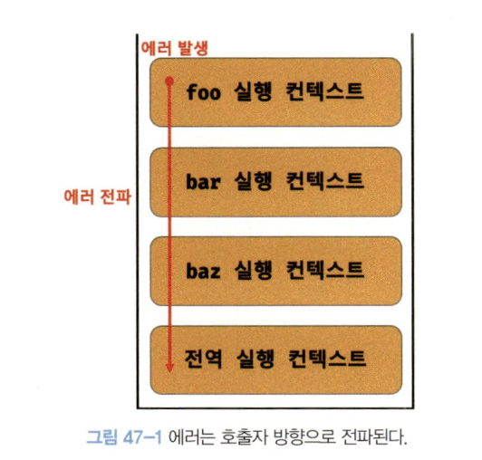

# 1. 에러 처리의 필요성

에러는 언제나 발생할 수 있다.

따라서 `try…catch` 문을 사용하면 발생한 에러에 적절하게 대응하여 프로그램의 강제 종료를 막을 수 있다.

하지만 직접적으로 에러를 발생시키지 않는 예외적인 상황이 발생할 수도 있다.

ex) `querySelector`를 사용할 때 DOM에서 요소 노드를 못 찾으면 `null` 반환하는 것

# 2. `try…catch…finally` 문

예외 처리 방법은 크게 두 가지가 있다.

1. 예외적인 상황이 발생하는 반환하는 값을 if 문이나 단축 평가 또는 옵셔널 체이닝 연산자를 통해 확인하여 처리하는 방법
2. 에러 처리 코드를 미리 등록해 두고 에러가 발생하면 에러 처리 코드로 점프하는 방법

```jsx
try {
  // 실행할 코드(에러 발생할 수도 있는 코드)
} catch (err) {
  // try 코드 블록에서 에러가 발생하면
  // 이 코드 블록의 코드가 실행된다.
  // try 코드 블록에서 발생한 Error 객체가 전달된다.
} finally {
  // 에러 발생과 상관없이 반드시 한 번 실행된다.
}
```

# 3. `Error` 객체

`Error` 생성자 함수는 에러 객체를 생성한다.

`Error` 생성자 함수에는 에러를 상세히 설명하는 에러 메세지를 인수로 전달할 수 있다.

```jsx
const error = new Error('invalid')
```

`Error` 생성자 함수가 생성한 에러 객체는 아래의 프로퍼티들을 갖는다.

`message 프로퍼티`: Error 생성자 함수에 인수로 전달한 에러 메세지

`stack 프로퍼티`: 에러를 발생시킨 콜 스택의 호출 정보

JS는 총 7가지의 에러 객체를 생성할 수 있는 Error 생성자 함수를 제공한다.

| 생성자 함수      | 인스턴스                                                                       |
| ---------------- | ------------------------------------------------------------------------------ |
| `Error`          | 일반적 에러 객체                                                               |
| `SyntaxError`    | JS 문법에 맞지 않는 문을 해석할 때 발생하는 에러 객체                          |
| `ReferenceError` | 참조할 수 없는 식별자를 참조했을 때 발생하는 에러 객체                         |
| `TypeError`      | 피연산자 또는 인수의 데이터 타입이 유효하지 않을 때 발생하는 에러 객체         |
| `RangeError`     | 숫자값의 허용 범위를 벗어났을 때 발생하는 에러 객체                            |
| `URIError`       | encodeURI 또는 decodeURI 함수에 부적절한 인수를 전달했을 때 발생하는 에러 객체 |
| `EvalError`      | eval 함수에서 발생하는 에러 객체                                               |

# 4. `throw` 문

Error 생성자 함수로 에러 객체를 생성한다고 해서 에러가 발생하는 것은 아니다.

에러 객체 생성과 에러 발생은 의미가 다르다.

에러를 발생시키려면 `try` 코드 블록에서 `throw` 문으로 에러를 던져야 한다.

여기서 에러를 던지면 catch 문의 에러 변수가 생성되고 던져진 에러 객체가 할당된다.

```jsx
try {
  throw new Error('something wrong')
} catch (error) {
  console.log(error)
}
```

# 5. 에러의 전파

에러는 콜 스택의 아래방향. 즉, 호출자 방향으로 전파된다.

```jsx
const foo = () => {
  throw Error('foo에서 발생한 에러')
}

const bar = () => {
  foo()
}

const baz = () => {
  bar()
}

try {
  baz()
} catch (err) {
  console.log(err)
}
```

위 코드의 에러 전파 방향은 다음과 같다.

이때 foo에서 throw 한 에러는 다음과 같이 전파되어 전역에서 캐치된다.



위 코드는 전역 에러 핸들링 과점에서는 좋은 구조라고 볼 수 있다.

다만 각 계층에서 에러를 인지할 수 있는 기회가 없기 때문에, 중간 핸들링 과정을 추가하여 이 점을 추가 보완할 수도 있다.

```jsx
const foo = () => {
  throw Error('foo에서 발생한 에러')
}

const bar = () => {
  try {
    foo()
  } catch (e) {
    console.warn('bar에서 에러 발생:', e.message)
    // 중간 처리 로직 추가할 수도 있음
    throw e // 전역으로도 던져줌
  }
}

const baz = () => {
  bar()
}

try {
  baz()
} catch (err) {
  console.log(err)
}
```

그럼 아래와 같은 에러를 볼 수 있다.


> 🤓 **`console.warn` vs `console.log` vs `console.error`**
>
> > | **메서드**      | **용도**                       | **콘솔 표시 방식**               |
> > | --------------- | ------------------------------ | -------------------------------- |
> > | `console.log`   | 일반적인 정보 출력 (디버깅 등) | 기본 색상 (흰색 또는 회색 등)    |
> > | `console.warn`  | 경고 메시지 출력               | 노란색 느낌표 아이콘과 함께 표시 |
> > | `console.error` | 에러 메시지 출력 (심각한 문제) | 빨간색 ❌ 아이콘과 함께 표시     |
> >
> > 
