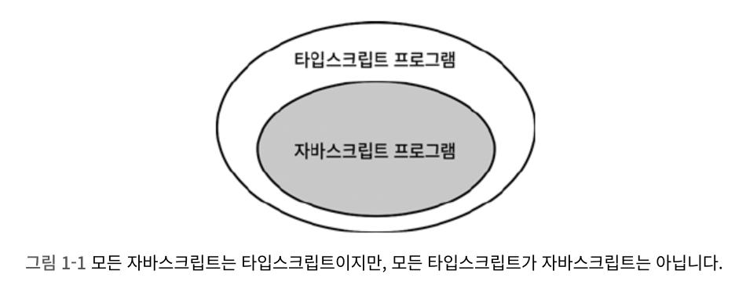
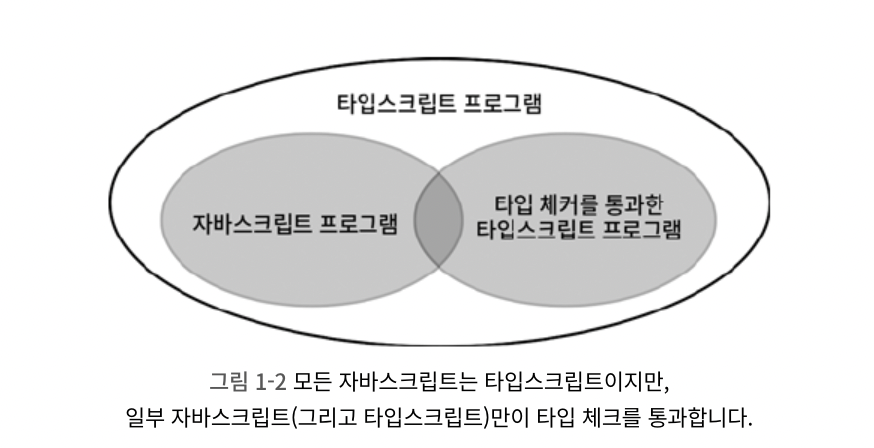
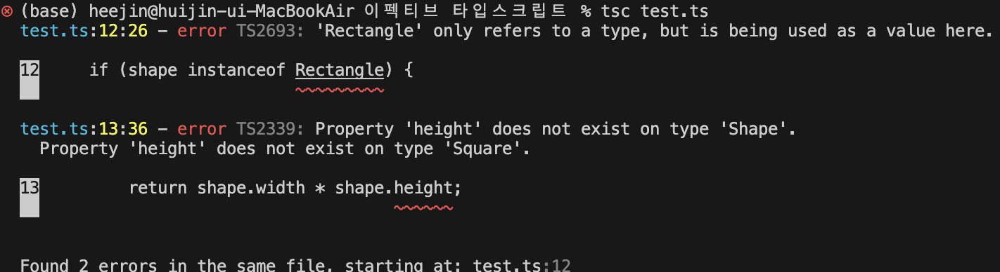

# Item 01. 타입스크립트와 자바스크립트의 관계 이해하기

타입스크립트는 타입이 정의된 자바스크립트의 상위집합이다.

자바스크립트와 타입스크립트는 서로 다른 확장자를 쓰지만, 완전히 다른 언어는 아니다. <br />
`.js` 파일에 있는 코드는 타입스크립트라고 할 수 있는 것이다.
따라서 이런 점은 자바스크립트를 타입스크립트로 migration하는 데 큰 이점이 된다.



타입스크립트는 타입을 명시하는 추가적인 문법을 갖기 때문이다. <br />

```ts
function greet(who: string) {
  console.log('Hello', who)
}
```

만약 위같은 타입 구문이 없으면, 타입 체커는 변수의 초깃값으로 **타입을 추론** 한다.

타입 시스템의 목표 중 하나는 런타임에 오류를 발생시킬 코드를 **미리 찾아내는 것** 이다. 그래서 타입스크립트가 '정적' 타입 시스템 언어라는 것이다. 그런데 타입 체커가 모든 오류를 찾아내진 않는다.

이미 정의한 변수명에 오탈자를 내는 경우에도, 타입 체커가 이를 잡아주기도 한다.

그렇기 때문에 이런 타입스크립트에게 타입 구문까지 추가한다면, 이 코드의 '의도'가 무엇인지 정확하게 타입스크립트에게 알려줄 수 있고 코드의 동작과 의도가 다른 부분을 찾을 수 있는 것이다.

따라서 첫 벤다이어그램에 아래의 항목이 추가될 수 있다. "타입 체커를 통과한 타입스크립트 프로그램"이다.



타입스크립트는 자바스크립트의 동작 방식을 기반으로 만들어졌다.
그래서 자바스크립트에서 정상적으로 동작하는 코드는 대부분 타입스크립트에서도 오류가 나지 않도록 설계되어 있는데, 이때 자바스크립트 코드의 **이상하지만 동작하는 코드** 를 잠재적인 오류로 보고 미리 알려준다.

책에는 다음과 같은 설명이 있다.

> 앞서 등장한 오류들이 발생하는 근본 원인은 타입스크립트가 이해하는 값의 타입과 실제 값에 차이가 있기 때문입니다. 타입 시스템이 정적 타입의 정확성을 보장해 줄 것 같지만 그렇지 않습니다. 애초에 타입 시스템은 그런 목적으로 만들어지지도 않았습니다.
> _- 8page_

나는 위 부분이 이해가 잘 가지 않았다. '타입스크립트가 잠재적인 오류를 알려주는 것이 곧 정확성을 보장한다는 뜻 아닌가?' <br />
책에는 위 내용에 이어서 `any`를 언급하고 있는데, 타입스크립트와 자바스크립트의 타입 검사 시기와 이를 엮어서 생각해보니 조금은 이해를 할 수 있었다.

예시로 `any`를 이용한 다음의 코드가 있다.

```ts
let value: any = '커피 99999잔'
;(value as string).toUpperCase()

value = 99999
;(value as string).toUpperCase()
```

위 코드에서 타입스크립트는 2번째 줄까지는 `value`의 타입을 문자열로 추론하고 오류를 발생시키지 않는다.
그런데 다음 라인에서 `vlaue`에 숫자가 재할당되었고, 런타임에서는 `toUpperCase()`가 없어서 오류가 발생한다.

이는 타입스크립트의 컴파일 과정과 연관이 있는데, 타입스크립트는 컴파일 과정에서 정적 타입 검사를 실행한다. <br />
이때 코드에 타입 오류가 없다면, 모든 타입 정보가 사라진 순수한 자바스크립트 코드로 변환된다. <br />
컴파일로 만들어진 자바스크립트 코드는 런타임에 동적 타입 검사를 실행한다. 따라서 `99999`로 재할당 된 `value.toUpperCase()`에서 `TypeError`가 발생하는 것이다.

즉, 타입스크립트는 정확성을 보장할 것 같지만 그렇지 못하게 되는 것이다.

책에서는 정확성이 중요하다면 `Reason`이나 `Elm` 같은 언어를 선택하는 것이 좋으나, 자바스크립트에서의 마이그레이션이 복잡하다고 한다.

# Item 02. 타입스크립트 설정 이해하기

타입스크립트의 컴파일러는 두 가지의 주요 역할을 수행한다.

1. 타입 체커(Type Checker): 코드를 분석해서 타입 오류가 있는지 검사한다.
2. 트랜스파일러(Transpiler): 타입 오류가 없는 코드를 자바스크립트로 변환한다.

타입스크립트 컴파일로는 매우 많은(약 100개 이상)의 설정을 가진다.
이는 `cli` 혹은 `tsconfig.json`를 통해 설정할 수 있는데, 동료들과의 협업이나 문서화를 위해 가급적 설정 파일을 이용하는 것이 좋다.

주요 설정 옵션은 다음과 같은 것들이 있다.

1. `noImplicitAny`: 변수들이 미리 정의된 타입을 가져야 하는지 여부를 제어한다. 가급적(웬만하면 무조건) 설정하는 것을 권장한다. 타입스크립트는 타입 정보를 가질 때 가장 효과적이다. 오류를 발견하기 수월하며, 코드의 가독성, 개발자의 생산성이 향상된다. 🪽
2. `strictNullChecks`: `null`과 `undefined`가 모든 타입에서 허용되는지 확인한다. 만약 `null` 값을 허용하지 않으려면 `null`을 체크하는 코드(ex, `if문`)나 단언문(`!` 연산자로 `null`이 아님을 단언하기)을 사용해야 한다.

# Item 03. 코드 생성과 타입이 관계없음을 이해하기

위에서 얘기한 타입스크립트 컴파일러의 역할은 완벽히 독립적이다.

타입스크립트가 자바스크립트로 변환될 때, 코드 내의 타입에 영향을 주지 않으며 변환된 자바스크립트 실행 시점에도 타입은 영향을 미치지 않는다.

따라서 **타입 오류가 있는 코드도 컴파일이 가능하다. 타입스크립트는 잠재적 오류를 알려주는 것이지, 빌드를 멈추는 것은 아니다.**

> 코드에 오류가 있다면, "타입 체크에 문제가 있다." 라고 하는 것이 더 정확한 표현이다.

> 만약 오류가 있을 때 컴파일을 멈추고싶다면, `tsconfig.json`에 `noEmitOnError`를 설정하면 된다.

---

타입스크립트가 자바스크립트로 컴파일되는 과정에서 모든 인터페이스, 타입, 타입 구문은 제거된다.

다음과 같은 예시가 있다.

```ts
interface Square {
  width: number
}

interface Rectangle extends Square {
  height: number
}

type Shape = Square | Rectangle

function calculateArea(shape: Shape) {
  if (shape instanceof Rectangle) {
    return shape.width * shape.height
  } else {
    return shape.width * shape.width
  }
}
```



> **나타난 오류**
>
> 1. `error TS2693: 'Rectangle' only refers to a type, but is being used as a value here.`
>
>    > `instanceof` 연산자는 오직 값에 대해서만 사용할 수 있는 자바스크립트 기능이다. 위 코드에서는 런타임에 `Rectangle` 이라는 값이 존재하지 않기 때문에, 오류가 발생한다.
>
> 2. `error TS2339: Property 'height' does not exist on type 'Shape'.`
>    > `calculateArea` 함수는 `shape` 매개변수를 받는데, `instanceof`를 확인할 수 없으니 `Shape` 내부에 `height` 속성이 있는지 알 수 없어 오류가 발생한다.

타입 오류를 해결하는 방법은 무엇일까? **런타임에 타입 정보를 유지하는 것이다.**

1. `in` 연산자를 사용한다.
   `in` 연산자는 특정 객체에 특정 속성이 있는지 확인한다. <br />
   특정 객체에 특정 키가 있으면 `true`를 반환, 없으면 `false`를 반환한다. <br />
   따라서 아래 코드의 `if('height' in shape)` 에서 타입스크립트의 타입 체커는 `shape`의 타입을 더 보정해서 추론한다. 이를 **타입 가드(Type Guard)** 라고 한다.

```ts
function calculateArea(shape: Shape) {
  if ('height' in shape) {
    shape
    return shape.width * shape.height
  } else {
    shape
    return shape.width * shape.width
  }
}
```

> 근데 나는 의문이 들었다. **"런타임에서는 타입스크립트의 타입 정보가 사라진다고 했는데, 어떻게 타입 정보의 속성을 참조할 수 있는 거지?"**
>
> > 먼저 '타입'은 가상의 설계도와 같은 것이고, '값'은 실제 컴퓨터 메모리에 저장되는 것이다.
> > 첫 번째 예시 코드에 쓰인 `instanceof`는 런타임에 존재하는 클래스를 필요로 하는데, `Rectangle`은 `interface`로 정의된 **타입** 이기 때문에 오류가 발생하게 되는 것이다.
> > 반면, 두 번째 예시 코드에 쓰인 `in`은 해당 객체의 실제 키 값을 필요로 하므로 오류가 발생하지 않는다.

2. '태그'기법을 사용한다.
   런타임에 접근 가능한 타입 정보를 명시적으로 저장하는 방식이다. <br />
   여기서 `Shape` 타입은 '**태그된 유니온(tagged union)'** 이다. <br />
   `Sqaure`와 `Rectangle`은 `kind` 속성을 통해 서로를 명확하게 구별할 수 잇다. <br />
   이 기법은 위의 방식들보다 훨씬 직관적이고 타입 측면에서 안전한 방식이다.

```ts
interface Square {
  kind: 'square'
  width: number
}

interface Rectangle {
  kind: 'rectangle'
  height: number
  width: number
}

type Shape = Square | Rectangle

function calculateArea(shape: Shape) {
  if (shape.kind === 'rectangle') {
    shape
    return shape.width * shape.height
  } else {
    shape
    return shape.width * shape.width
  }
}
```

3. 타입(런타입 접근 불가)과 값(런타임 접근 가능)을 둘 다 사용한다.
   이전에 타입으로 사용했던 `Sqaure`와 `Rectangle`을 클래스로 선언하면 타입과 값으로 모두 사용할 수 있게 된다.

```ts
class Square {
  constructor(public width: number) {}
}

class Rectangle extends Square {
  constructor(public width: number, public height: number) {
    super(width)
  }
}

type Shape = Square | Rectangle // 타입으로 참조

function calculateArea(shape: Shape) {
  if (shape instanceof Rectangle) {
    // 값으로 참조
    shape
    return shape.width * shape.height
  } else {
    shape
    return shape.width * shape.width
  }
}
```
