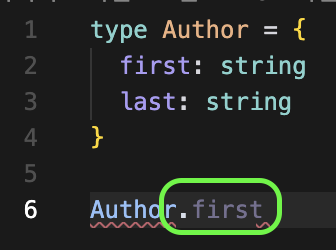
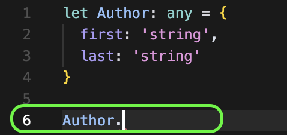
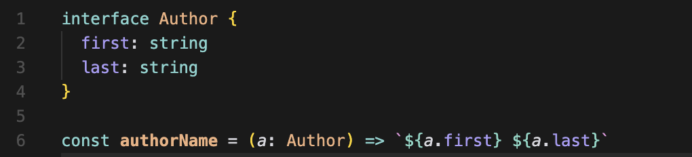
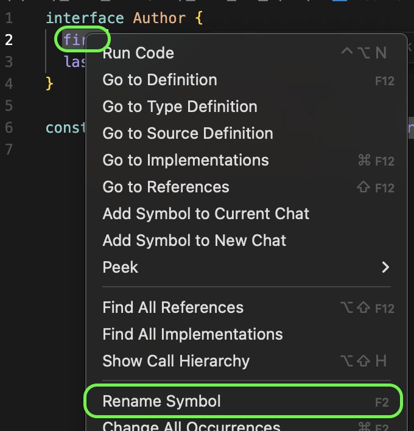

# Item 01. 타입스크립트와 자바스크립트의 관계 이해하기

타입스크립트는 타입이 정의된 자바스크립트의 상위집합이다.

자바스크립트와 타입스크립트는 서로 다른 확장자를 쓰지만, 완전히 다른 언어는 아니다. <br />
`.js` 파일에 있는 코드는 타입스크립트라고 할 수 있는 것이다.
따라서 이런 점은 자바스크립트를 타입스크립트로 migration하는 데 큰 이점이 된다.


타입스크립트는 타입을 명시하는 추가적인 문법을 갖기 때문이다. <br />

```ts
function greet(who: string) {
  console.log('Hello', who)
}
```

만약 위같은 타입 구문이 없으면, 타입 체커는 변수의 초깃값으로 **타입을 추론** 한다.

타입 시스템의 목표 중 하나는 런타임에 오류를 발생시킬 코드를 **미리 찾아내는 것** 이다. 그래서 타입스크립트가 '정적' 타입 시스템 언어라는 것이다. 그런데 타입 체커가 모든 오류를 찾아내진 않는다.

이미 정의한 변수명에 오탈자를 내는 경우에도, 타입 체커가 이를 잡아주기도 한다.

그렇기 때문에 이런 타입스크립트에게 타입 구문까지 추가한다면, 이 코드의 '의도'가 무엇인지 정확하게 타입스크립트에게 알려줄 수 있고 코드의 동작과 의도가 다른 부분을 찾을 수 있는 것이다.

따라서 첫 벤다이어그램에 아래의 항목이 추가될 수 있다. "타입 체커를 통과한 타입스크립트 프로그램"이다.


타입스크립트는 자바스크립트의 동작 방식을 기반으로 만들어졌다.
그래서 자바스크립트에서 정상적으로 동작하는 코드는 대부분 타입스크립트에서도 오류가 나지 않도록 설계되어 있는데, 이때 자바스크립트 코드의 **이상하지만 동작하는 코드** 를 잠재적인 오류로 보고 미리 알려준다.

책에는 다음과 같은 설명이 있다.

> 앞서 등장한 오류들이 발생하는 근본 원인은 타입스크립트가 이해하는 값의 타입과 실제 값에 차이가 있기 때문입니다. 타입 시스템이 정적 타입의 정확성을 보장해 줄 것 같지만 그렇지 않습니다. 애초에 타입 시스템은 그런 목적으로 만들어지지도 않았습니다.
> _- 8page_

나는 위 부분이 이해가 잘 가지 않았다. '타입스크립트가 잠재적인 오류를 알려주는 것이 곧 정확성을 보장한다는 뜻 아닌가?' <br />
책에는 위 내용에 이어서 `any`를 언급하고 있는데, 타입스크립트와 자바스크립트의 타입 검사 시기와 이를 엮어서 생각해보니 조금은 이해를 할 수 있었다.

예시로 `any`를 이용한 다음의 코드가 있다.

```ts
let value: any = '커피 99999잔'
;(value as string).toUpperCase()

value = 99999
;(value as string).toUpperCase()
```

위 코드에서 타입스크립트는 2번째 줄까지는 `value`의 타입을 문자열로 추론하고 오류를 발생시키지 않는다.
그런데 다음 라인에서 `vlaue`에 숫자가 재할당되었고, 런타임에서는 `toUpperCase()`가 없어서 오류가 발생한다.

이는 타입스크립트의 컴파일 과정과 연관이 있는데, 타입스크립트는 컴파일 과정에서 정적 타입 검사를 실행한다. <br />
이때 코드에 타입 오류가 없다면, 모든 타입 정보가 사라진 순수한 자바스크립트 코드로 변환된다. <br />
컴파일로 만들어진 자바스크립트 코드는 런타임에 동적 타입 검사를 실행한다. 따라서 `99999`로 재할당 된 `value.toUpperCase()`에서 `TypeError`가 발생하는 것이다.

즉, 타입스크립트는 정확성을 보장할 것 같지만 그렇지 못하게 되는 것이다.

책에서는 정확성이 중요하다면 `Reason`이나 `Elm` 같은 언어를 선택하는 것이 좋으나, 자바스크립트에서의 마이그레이션이 복잡하다고 한다.

# Item 02. 타입스크립트 설정 이해하기

타입스크립트의 컴파일러는 두 가지의 주요 역할을 수행한다.

1. 타입 체커(Type Checker): 코드를 분석해서 타입 오류가 있는지 검사한다.
2. 트랜스파일러(Transpiler): 타입 오류가 없는 코드를 자바스크립트로 변환한다.

타입스크립트 컴파일로는 매우 많은(약 100개 이상)의 설정을 가진다.
이는 `cli` 혹은 `tsconfig.json`를 통해 설정할 수 있는데, 동료들과의 협업이나 문서화를 위해 가급적 설정 파일을 이용하는 것이 좋다.

주요 설정 옵션은 다음과 같은 것들이 있다.

1. `noImplicitAny`: 변수들이 미리 정의된 타입을 가져야 하는지 여부를 제어한다. 가급적(웬만하면 무조건) 설정하는 것을 권장한다. 타입스크립트는 타입 정보를 가질 때 가장 효과적이다. 오류를 발견하기 수월하며, 코드의 가독성, 개발자의 생산성이 향상된다. 🪽
2. `strictNullChecks`: `null`과 `undefined`가 모든 타입에서 허용되는지 확인한다. 만약 `null` 값을 허용하지 않으려면 `null`을 체크하는 코드(ex, `if문`)나 단언문(`!` 연산자로 `null`이 아님을 단언하기)을 사용해야 한다.

# Item 03. 코드 생성과 타입이 관계없음을 이해하기

위에서 얘기한 타입스크립트 컴파일러의 역할은 완벽히 독립적이다.

타입스크립트가 자바스크립트로 변환될 때, 코드 내의 타입에 영향을 주지 않으며 변환된 자바스크립트 실행 시점에도 타입은 영향을 미치지 않는다.

따라서 **타입 오류가 있는 코드도 컴파일이 가능하다. 타입스크립트는 잠재적 오류를 알려주는 것이지, 빌드를 멈추는 것은 아니다.**

> 코드에 오류가 있다면, "타입 체크에 문제가 있다." 라고 하는 것이 더 정확한 표현이다.

> 만약 오류가 있을 때 컴파일을 멈추고싶다면, `tsconfig.json`에 `noEmitOnError`를 설정하면 된다.

---

타입스크립트가 자바스크립트로 컴파일되는 과정에서 모든 인터페이스, 타입, 타입 구문은 제거된다.

다음과 같은 예시가 있다.

```ts
interface Square {
  width: number
}

interface Rectangle extends Square {
  height: number
}

type Shape = Square | Rectangle

function calculateArea(shape: Shape) {
  if (shape instanceof Rectangle) {
    return shape.width * shape.height
  } else {
    return shape.width * shape.width
  }
}
```


> **나타난 오류**
>
> 1. `error TS2693: 'Rectangle' only refers to a type, but is being used as a value here.`
>
>    > `instanceof` 연산자는 오직 값에 대해서만 사용할 수 있는 자바스크립트 기능이다. 위 코드에서는 런타임에 `Rectangle` 이라는 값이 존재하지 않기 때문에, 오류가 발생한다.
>
> 2. `error TS2339: Property 'height' does not exist on type 'Shape'.`
>    > `calculateArea` 함수는 `shape` 매개변수를 받는데, `instanceof`를 확인할 수 없으니 `Shape` 내부에 `height` 속성이 있는지 알 수 없어 오류가 발생한다.

타입 오류를 해결하는 방법은 무엇일까? **런타임에 타입 정보를 유지하는 것이다.**

1. `in` 연산자를 사용한다.
   `in` 연산자는 특정 객체에 특정 속성이 있는지 확인한다. <br />
   특정 객체에 특정 키가 있으면 `true`를 반환, 없으면 `false`를 반환한다. <br />
   따라서 아래 코드의 `if('height' in shape)` 에서 타입스크립트의 타입 체커는 `shape`의 타입을 더 보정해서 추론한다. 이를 **타입 가드(Type Guard)** 라고 한다.

```ts
function calculateArea(shape: Shape) {
  if ('height' in shape) {
    shape
    return shape.width * shape.height
  } else {
    shape
    return shape.width * shape.width
  }
}
```

> 근데 나는 의문이 들었다. **"런타임에서는 타입스크립트의 타입 정보가 사라진다고 했는데, 어떻게 타입 정보의 속성을 참조할 수 있는 거지?"**
>
> > 먼저 '타입'은 가상의 설계도와 같은 것이고, '값'은 실제 컴퓨터 메모리에 저장되는 것이다.
> > 첫 번째 예시 코드에 쓰인 `instanceof`는 런타임에 존재하는 클래스를 필요로 하는데, `Rectangle`은 `interface`로 정의된 **타입** 이기 때문에 오류가 발생하게 되는 것이다.
> > 반면, 두 번째 예시 코드에 쓰인 `in`은 해당 객체의 실제 키 값을 필요로 하므로 오류가 발생하지 않는다.

2. '태그'기법을 사용한다.
   런타임에 접근 가능한 타입 정보를 명시적으로 저장하는 방식이다. <br />
   여기서 `Shape` 타입은 '**태그된 유니온(tagged union)'** 이다. <br />
   `Sqaure`와 `Rectangle`은 `kind` 속성을 통해 서로를 명확하게 구별할 수 잇다. <br />
   이 기법은 위의 방식들보다 훨씬 직관적이고 타입 측면에서 안전한 방식이다.

```ts
interface Square {
  kind: 'square'
  width: number
}

interface Rectangle {
  kind: 'rectangle'
  height: number
  width: number
}

type Shape = Square | Rectangle

function calculateArea(shape: Shape) {
  if (shape.kind === 'rectangle') {
    shape
    return shape.width * shape.height
  } else {
    shape
    return shape.width * shape.width
  }
}
```

3. 타입(런타입 접근 불가)과 값(런타임 접근 가능)을 둘 다 사용한다.
   이전에 타입으로 사용했던 `Sqaure`와 `Rectangle`을 클래스로 선언하면 타입과 값으로 모두 사용할 수 있게 된다.

```ts
class Square {
  constructor(public width: number) {}
}

class Rectangle extends Square {
  constructor(public width: number, public height: number) {
    super(width)
  }
}

type Shape = Square | Rectangle // 타입으로 참조

function calculateArea(shape: Shape) {
  if (shape instanceof Rectangle) {
    // 값으로 참조
    shape
    return shape.width * shape.height
  } else {
    shape
    return shape.width * shape.width
  }
}
```

---

위에서 계속 언급한 것처럼, **타입 연산은 런타임에 영향을 주지 않는다.** <br />
예시로 다음과 같은 코드를 살펴보자.

```ts
function asNumber(val: number | string): number {
  return val as number // 'as number'는 '타입 단언문'이다.
}
```

위 코드는 아래의 자바스크립트 코드로 변환된다. <br />
모든 타입 관련 연산은 사라지게 된다.

```js
function asNumber(val) {
  return val
}
```

따라서 타입 체커 통과 및 값 정제를 위해서는 다음과 같이 타입스크립트 코드를 작성해야 한다.

```ts
function asNumber(val: number | string): number {
  return typeof val === 'string' ? Number(val) : val
}
```

---

타입스크립트는 함수 오버로딩을 지원하지만, 타입 수준에서만 가능하다. <br />
여러 개의 함수를 따로 구현하는 것이 아니라, 하나의 함수 구현체에 여러 개의 타입 선언을 연결해야 한다.

잘못된 예시(함수 오버로딩) 🙅🏻‍♀️

```ts
function add(a: number, b: number) {
  return a + b
}
function add(a: string, b: string) {
  return a + b
}
```

올바른 예시(구현체) 🙆🏻‍♀️ <br />
1, 2번 라인은 함수 선언이다. add 함수의 매개변수에 대한 반환 값을 알려주는 역할을 하며, 컴파일 후 사라진다. <br />
4번째 라인은 함수 구현체(implement)이다. 런타임에 실제로 실행되는 코드이다.

```ts
function add(a: number, b: number): number
function add(a: string, b: string): string

function add(a: any, b: any): any {
  return a + b
}
```

> **'`any`는 쓰면 안 되는 거 아닌가?'** 라는 생각이 들었다.
>
> > 다만 위 코드에서 `any`를 쓰는 이유는
> >
> > 1.  `a + b` 연산이 `number`일 때와 `string`인 두 경우 모두에서 유효하기 때문이다.
> >
> > 2.  `a`와 `b`가 number일 때와 `string`일 때를 모두 한 함수에서 처리하기 위해 가장 넓은 범위를 포괄하는 타입이 필요했기 때문이다.

---

타입과 타임 검사는 코드의 런타임 성능(실행 속도)에 전혀 영향을 주지 않는다고 한다. <br />
실제 런타임엔 모든 타입 정보가 제거된 자바스크립트 코드가 동작하기 때문이다.

책에서는 '빌드타임 오버헤드'를 언급한다. <br />
'빌드타임 오버헤드'란 타입스크립트 코드가 자바스크립트 코드로 변환되는 과정, 즉 컴파일하는데 걸리는 시간을 의미한다.

타입스크립트 팀은 이 빌드타임을 최소화하기 위해, 코드가 조금만 바뀌었을 때 전체 코드를 다시 컴파일하지 않고, 변경된 부분만 빠르게 처리하는 증분(incremental) 빌드를 통해 오버헤드를 줄인다고 한다.

만약 타입 체크 과정이 너무 오래 걸리면 타입 체크는 건너뛰고 트랜스파일 기능만 사용할 수도 있다고 한다. -> `transpileOnly 설정`

# Item 04. 구조적 타이핑에 익숙해지기

타입스크립트는 자바스크립트의 동작을 모델링한다. 자바스크립트는 '덕 타이핑(duck typing)' 기반 언어이다. 따라서 타입스크립트도 덕 타이핑을 기반으로 동작한다.

> 덕 타이핑이란, 객체가 어떤 타입에 부합하는 변수와 메서드를 가지면, 그 객체를 해당 타입에 속하는 것으로 간주하는 것이다.
>
> 예를 들어, 만약 어떤 새(객체)가 오리(타입)처럼 걷고 헤엄치고 꽥꽥거린다면 그 새(객체)는 오리(타입)라고 부를 수 있다.

자바스크립트와 타입스크립트 환경에서는 **구조** 가 중요하다. 어떤 객체가 특정 함수가 필요로 하는 모든 속성을 가지고 있으면, 그 객체의 타입이 무엇이든 해당 함수에 전달할 수 있다.

책에서는 다음의 예시 코드를 보여준다.

```ts
interface Vector2D {
  x: number
  y: number
}

/* 벡터 계산 메서드
v라는 객체에 x와 y가 있는지, 숫자 타입인지만 확인하고
그 외에 어떤 속성이 있/없는지는 확인 안 함 */

function calculateLength(v: Vector2D) {
  return Math.sqrt(v.x * v.x + v.y * v.y)
}

interface NamedVector {
  name: string
  x: number
  y: number
}

/* 타입스크립트는 여서 v가 calculateLength가 요구하는 구조를 가지고 있는지 확인한다.
v는 x와 y를 가지기 때문에 에러가 발생하지 않는다. */

const v: NamedVector = { x: 3, y: 4, name: 'Zee' }
calculateLength(v)
```

그런데 구조적 타이핑은 예기치 못한 버그를 만들어내기도 한다. <br />
타입스크립트는 객체의 이름이 아닌, 구조를 보고 호환성을 판단하기 때문이다.

```ts
interface Vector3D {
  x: number
  y: number
  z: number
}

// 3D 벡터를 정규화하는 함수 (길이를 1로 만든다.)
function normalize(v: Vector3D) {
  // 실수로 2D 벡터용 함수에 3D 벡터를 전달했지만 오류가 발생하지 않는다.
  const length = calculateLength(v)
  return {
    x: v.x / length,
    y: v.y / length,
    z: v.z / length,
  }
}

const v3d: Vector3D = { x: 3, y: 4, z: 5 }
console.log(normalize(v3d))
// 출력: { x: 0.6, y: 0.8, z: 1 }
```

타입스크립트가 오류를 내지 않은 이유는, `calculateLength` 함수는 `Vector2D` 타입의 객체를 요구했고, `normalize` 함수는 `Vector3D` 타입의 객체를 넘겨주었다. <br />
`Vector3D` 는 `x`와 `y`라는 속성을 모두 가지고 있기 때문에, 타입스크립트는 `Vector3D`와 `Vector2D`와 호환되는 것이라 판단하게 되고, 오류를 발생시키지 않는 것이다.

> 따라서 타입스크립트의 타입은 open되어 있다고 볼 수 있다. 최소한 이러이러한 타입을 갖는다는 것이지, 오직 이것만 가진다는 의미가 아니다.

다만 타입의 "열린" 특성은 오류를 발생시키기도 한다.

```ts
function calculateLengthL1(v: Vector3D) {
  let length = 0
  for (const axis of Object.keys(v)) {
    const coord = v[axis] // 오류 발생
    length += Math.abs(coord)
  }
  return length
}
```

위 코드에서 `Object.keys()`는 객체의 속성 이름을 배열로 반환하는데, 이 속성 이름은 `string[]` 타입이다. <br />
따라서 `axis`는 `string` 타입이 되고, 타입스크립트는 `v['z']`나 `v['zz']` 같은 존재하지 않는 속성에도 접근할 수 있다고 판단한다. 하지만 `v['zz']`는 `number` 타입이 아니므로, `Math.abs()`에 전달될 수 없기에 오류가 발생한다. <br />
이런 경우에는 루프를 돌기보다, `v.x, v.y, v.z`와 같이 명확하게 속성에 접근하는 것이 안전하다.

클래스도 결국 구고적 타이핑의 규칙을 따른다.

```ts
class C {
  foo: string
  constructor(foo: string) {
    this.foo = foo
  }
}

const d: C = { foo: 'object literal' } // 정상
```

타입스크립트는 `d`가 `C 클래스`로부터 만들어진 인스턴스인지 여부를 따지지 않는다. 대신, `d`의 구조가 `C`가 요구하는 `최소한의 구조(foo: string)`를 만족하는지만 확인한다.

이러한 특징은, 테스트를 작성할 때도 강력한 이점을 제공한다.
책에서는 `PostgresDB` 로 예시를 들고 있는데, 예를 들어 아래와 같은 코드가 있다.

```ts
interface Author {
  first: string
  last: string
}

// 실제 PostgresDB 데이터베이스 객체를 사용합니다.
function getAuthors(database: PostgresDB): Author[] {
  // 실제 DB에 쿼리를 날리는 로직...
}
```

`getAuthors` 함수는 테스트할 떄마다 실제 디비에 접속하여 데이터를 관리해야 한는데, 이 작업은 매우 오래 걸리고 비효율적인 작업이다.

따라서 `PostgresDB` 의 모든 기능이 아니라, getAuthors 함수가 사용하는 runQuery 메서드만 가진 모킹 객체를 만들어 쉽게 테스트할 수 있다.

# Item 05. any 타입 지양하기

타입스크립트는 타입을 추가할 수도, 언제든 타입 체커를 해제할 수도 있기 때문에 **점진적** 이며 **선택적** 이다. 이 기능의 핵심이 `any` 타입이다. <br />
다만 `any`를 남발하는 것은 타입스크립트의 수많은 장점을 누릴 수 없게 되므로, `any`의 위험성을 인지해야 한다.

아래 코드를 통해 이를 이해해본다.

```ts
let age: number
age = '12' as any
```

## 5-1. any 타입에는 타입 안전성이 없다.

`age`는 `number 타입`으로 선언되었으나, ``as any`를 사용하므로써 s`tring 타입`을 할당할 수 있게 되었다. 다만 타입 체커는 여전히 선언에 따라 `age`를 `number 타입`으로 판단하므로 결국 혼돈이 발생한다.

```ts
age += 1 // 런타임에는 정상이지만, age는 "121" 값을 갖게 된다.
```

## 5-2. any는 함수 시그니처(contract-계약)를 무시해 버린다.

함수를 작성할 땐 그 시그니처(약속)을 지켜야 한다. <br />
호출하는 쪽은 약속된 타입의 입력을 제공하고, 함수는 약속된 타입의 출력을 반환한다. <br />
이때 `any`를 사용하면 이러한 약속을 어길 수 있다.

```ts
function calculateAge(birthDate: Date): number {
  // ...
}

let birthDate: any = '2002-12-12'
calculateAge(birthDate)
```

위 코드는 `calculateAge`의 시그니처를 무시한다. 이러한 경우, 런타임인 자바스크립트 환경에서 **암시적 타입 변환(Implicit Type Coercion)** 이 발생했을 때 오류가 발생할 수 있다.

> 암시적 타입 변환이란?
>
> > 개발자가 명시적으로 지시하지 않았음에도, 특정 연산을 수행하기 위해 자바스크립트 엔진이 자동으로 값의 타입을 다른 타입으로 바꾸는 현상이다.
> >
> > **예시 1. 숫자와 문자열의 덧셈**
> >
> > ```js
> > const result = 5 + '5'
> >
> > console.log(result) // '55'
> > console.log(typeof result) // 'string'
> >
> > // 숫자 5은 자동으로 문자열 '5'으로 변환된 후 '5'와 연결된다.
> > ```
> >
> > **예시 2. 느슨한 동등 비교 (==)**
> >
> > ```js
> > // 숫자 10과 문자열 '10'을 비교할 때
> > console.log(10 == '10') // true
> > console.log(10 == '10a') // false (변환 불가능)
> >
> > // 불리언 true와 숫자 1을 비교할 때
> > console.log(true == 1) // true
> >
> > // `==` 연산자는 값만 비교하고, 타입은 무시하기 때문에 비교하기 전에 내부적으로 타입을 일치시키려고 시도한다.
> > ```

## 5-3. any 타입에는 언어 서비스가 적용되지 않는다.

어떤 심벌에 타입이 있으면 타입스크립트 언어 서비스는 자동완성 기능과 적절한 도움말을 제공하는데, any 타입인 심벌에 대해서는 아무런 기능도 제공하지 않는다.

|       1. 타입이 있는 심벌        |        2. any 타입인 심벌         |
| :------------------------------: | :-------------------------------: |
|  |  |

타입이 있는 심벌은 `Rename Symbol` 기능을 통해 타입 속성의 이름을 한꺼번에 변경할 수도 있다.

|       1. 타입 선택        |       2. 타입 속성 이름 변경        |
| :-----------------------: | :---------------------------------: |
|  |  |

## 5-4. any 타입은 코드 리팩터링 때 버그를 감춘다.

코드 리팩토링 시 `any` 타입을 사용하면, 예상치 못한 버그를 발생시킬 수도 있다.

에를 들어, 어떤 함수의 매개변수를 다음과 같이 설정해두었다.

```ts
function handleSelectItem(item: any) {
  selectedId = item.id
}
```

이후 코드 리팩토링 과정을 거쳐, 해당 함수에 `number 타입`의 `id`를 전달하는 것으로 변경하였다. 이때 `handleSelectItem` 코드는 이에 맞춰 수정하지 않아도 타입 체커는 오류를 잡지 못한다. `any`를 사용했기 때문이다. <br />
다만 이런 경우, 런타임에서 오류가 발생할 수도 있다. 따라서 `any` 타입보다 구체적인 타입을 사용하는 것이 오류 발견에 용이하다.

## 5-5. any는 타입 설계를 감춰버린다.

깔끔하고 정확, 명료한 코드 작성을 위해서는 제대로 된 타입 설계가 필수이다. <br />
any 타입을 사용하면 타입 설계가 불분명하여, 설계가 어떻게 되어있는지 전혀 일 수가 없게 된다. <br />
함께 작업하는 동료가 있다면, 협업의 생산성을 위해서도 설계가 명확히 보이도록 타입을 작성하는 것이 좋다.

## 5-6. any는 타입시스템의 신뢰도를 떨어뜨린다.

개발자가 할 수 있는 실수를 타입 체커가 잡아주고, 따라서 코드의 신뢰도가 올라가는 건데 런타임에 타입 오류를 발견하게 된다면 타입 체커를 신뢰할 수 없게 될 것이다. any는 이런 문제를 야기할 수 있다.
