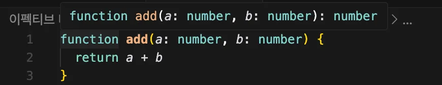
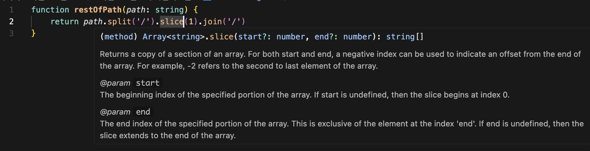
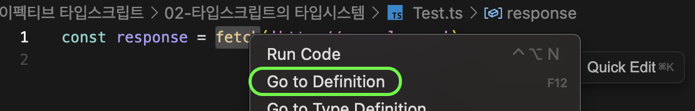
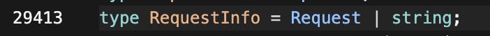
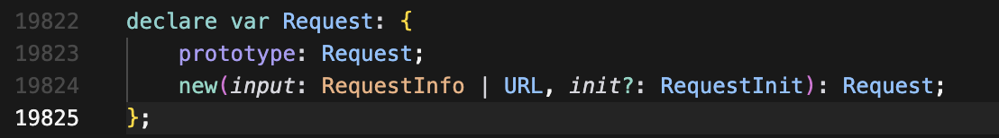
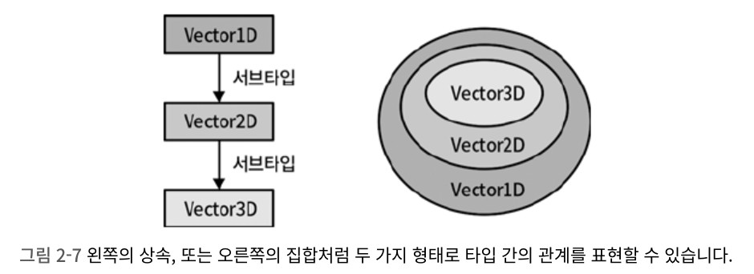
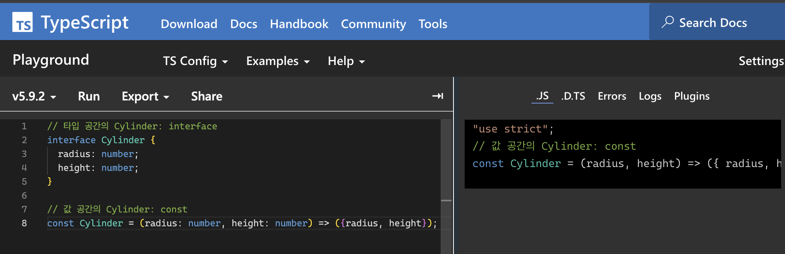

> 타입 시스템은 무엇인가? 어떻게 사용해야 하는가, 무엇을 결정해야 하는가, 사용하지 말아야 하는 기능은 무엇일까?

# Item 06. 편집기를 사용하여 타입 시스템 탐색하기

타임스크립트를 설치하면 다음의 두 가지를 실행할 수 있다.

1. 타입스크립트 컴파일러 (tsc)
2. 단독으로 실행할 수 있는 타입스크립트 서버 (tsserver)

이 외에도 타입스크립트는 언어 서비스를 제공하는데, 이 서비스는 코드 자동 완성, 명세(spection) 검사, 검색, 리팩터링 등을 포함한다.

이 서비스를 사용하면 읽기 쉬운 코드를 작성할 수 있다.

예를 들어, 타입스크립트는 다음과 같이 함수의 **타입을 추론**할 수 있다. _이는 추후 나오는 타입 넓히기(Item 21), 좁히기(Item 22)와 관련이 있다._


---

타입 추론은 디버깅에도 용이하다. <br />
예를 들어, 다음과 같이 메서드 체인이 있다.

> 메서드 체인이란?
> 여러 메서드가 연속적으로 호출되는 구조

```ts
function restOfPath(path: string) {
  return path.split('/').slice(1).join('/')
}
```



타입스크립트의 타입 추론을 통해 `path.split('/')`은 string[]을 반환하고, slice는 배열의 일부를 잘라내는 새로운 배열을 반활하는 것을 알 수 있다. 현재는 간단한 메서드 체인이지만, 메서드 체인이 길어지고 복잡해질수록 중간 단계에서 타입이 어떻게 변화하는지 확인할 수 있다.

---

언어 서비스는 라이브러리와 라이브러리의 타입 선언을 탐색할 때도 도움이 된다. 만약 특정 함수에 대해 더 자세히 알고싶다면 편집기의 `Go to Definition` 옵션을 이용하면 된다. (cmd + 마우스 좌클릭)



1. `lib.dom.d.ts`에 `fetch`는 다음과 같이 선언되어 있다.
   

   fetch 함수의 이름, 매개변수들과 반환하는 타입이 명시되어 있다.

2. `fetch`의 첫 번째 매개변수인 `RequestInfo`는 다음과 같이 선언되어 있다.
   

   `RequestInfo`는 `Request` 또는 `string` 타입 중 하나가 될 수 있는 유니온 타입이다.

3. Request의 타입 선언은 다음과 같이 선언되어 있다.
   

   여기서 `Request` 타입과 값은 분리되어 있다.

   **line 19822**의 `var Request`는 **`Request`가 값으로 존재**한다는 것을 선언한다. <br />
   **line 19823**의 `prototype: Request`는 **`Request` 생성자가 만들어내는 인스턴스들의 프로톼입**을 가리킨다. <br />
   **line 19824**의 `new(input: RequestInfo, init?: RequestInit): Request;`는 `Request` 생성자가 **`RequestInfo`와 R`equestInit`을 받아 `Request` 타입의 객체를 반환**한다는 것을 명시한다.

> **`type`, `interface`, `declare의` 차이에 대하여**
>
> > 1.  `interface`
> >
> >     객체의 모양(구조)를 정의하는 데 사용된다. <br />
> >     특정 객체가 어떤 속성과 메서드를 가져야 하는지 명시하는 '설계도'이며, 병합이 가능하다. <br />
> >     동일한 이름의 interface를 여러 번 선언하면, 타입스크립트가 이들을 하나로 합쳐준다.
> >
> >     ```ts
> >     interface Person {
> >       name: string
> >     }
> >
> >     interface Person {
> >       age: number
> >     }
> >     // 두 interface가 하나로 병합되어 { name: string; age: number; }가 됨
> >     const user: Person = { name: 'Hazel', age: 90 }
> >     ```
> >
> > 2.  `type`
> >
> >     새로운 타입의 이름을 만드는 데 사용된다. (interface보다 복잡한 타입을 정의할 때 사용한다.) <br />
> >     객체 모양뿐만 아니라 원시 타입, 유니온(`|`), 인터섹션(`&`), 튜플 등 다양한 타입을 정의할 수 있다. <br />
> >     별칭을 만드는 데 유용하고, 동일한 이름으로 여러 번 선언하면 오류가 발생한다.
> >
> >     ```ts
> >     type ID = string | number
> >     type User = {
> >       name: string
> >       id: ID
> >     }
> >     // type은 병합되지 않음
> >     ```
> >
> > 3.  `declare`
> >
> >     타입스크립트가 아닌 위부에서 온 코드의 타입 정보를 선언할 때 사용된다. <br />
> >     해당 변수가 프로젝트의 어딘가에 존재하므로, 타입스크립트가 검사할 때 오류를 발생하지 않도록 알려주는 역할을 한다.
> >
> >     [🔎 참고 - [Typescript] declare](https://html-jc.tistory.com/604)

# Item 07. 타입이 값들의 집합이라고 생각하기

타입스크립트는 컴파일 과정에서 오류를 체크하는데, 이때 식별자들은 모두 타입을 가진다. <br />
이 타입은 '할당 가능한 값들의 집합'이라고 볼 수 있고, 이는 타입의 '범위'라고 부르기도 한다.

타입스크립트에서 **가장 작은 집합은 `never` 타입**으로, 아무것도 포함하지 않는 **공집합**이다. <br />
`any` 타입의 값을 포함해 어떤 값도 가질 수 없다.

> **`never` 타입은 왜 존재하는 걸까?**
>
> 프로그래밍에서 "불가능"을 명확하게 표현할 필요가 있다. <br />
> 예를 들어, 절대로 실행이 끝나지 않는 함수의 반환값(`process.exit` 등), 불가능한 분기, 허용되지 않는 매개변수 타입 등이 있다.
>
> > never 타입은 실제로 다음과 같은 상황에 사용된다.
> >
> > 1.  **허용되지 않는 함수 인수 제한**
> >
> >     함수가 오직 `never` 타입만 받도록 하여, 다른 값이 들어오는 것을 방지할 수 있다.
> >
> >     > 함수가 오직 `never` 타입만 받아야 하는 이유는 뭘까? <br />
> >     >
> >     > `never` 타입은 실제로 **"절대 발생할 수 없는 값"** 을 나타낸다. <br />
> >     > 함수가 `never` 타입만 받을 때는, **진짜로 그 함수가 실행될 일이 없다는 걸 타입 시스템이 보장**해주기 때문이다. <br />
> >
> >     예를 들어, 조건문에서 모든 상황을 처리한 뒤, 남는 케이스가 있으면 그건 논리적으로 말이 안 되는 경우이다. <br />
> >     이때 `never` 타입을 사용하면, “여기까지 오면 문제가 있다”는 걸 코드로 표현할 수 있다.
> >
> >     ```ts
> >     type Animal = 'cat' | 'dog'
> >
> >     function speak(animal: Animal) {
> >       if (animal === 'cat') {
> >         console.log('야옹')
> >       } else if (animal === 'dog') {
> >         console.log('멍멍')
> >       } else {
> >         // 이 부분은 실제로 실행될 일이 없어야 한다.
> >         // 그래서 never 타입을 사용해서, 잘못된 값이 들어오면 오류를 잡아줄 수 있다.
> >         const _exhaustiveCheck: never = animal
> >         throw new Error('알 수 없는 동물!')
> >       }
> >     }
> >     ```
> >
> >     이렇게 하면 타입스크립트가 “모든 상황을 다 처리했는지” 검사해서, 만약 `Animal`에 새로운 값이 추가됐는데 코드에 반영하지 않으면 에러를 내준다.　<br />
> >     👏🏻 즉, **모든 상황을 다뤘는지 보장해주는 역할**을 한다.
> >
> > 2.  **유니온/타입 교차와 never의 특성**
> >
> >     ```
> >     never | string → string (string과 never의 합집합 이므로 never는 유니언에서 사라짐)
> >     never & string → never (string과 never의 교집합이므로 never가 됨)
> >     ```
> >
> >     > 2-1. **타입 교차란?**
> >     >
> >     > 여러 타입을 합쳐서, 모든 타입의 속성을 동시에 가지는 타입을 만드는 기술이다. <br />
> >     > 일반적인 교집합은 공통된 요소를 찾는 개념이지만, 타입스크립트의 교차(`&`)는 두 타입의 모든 속성을 합치는 것을 의미한다.
> >     >
> >     > ```ts
> >     > type A = { a: string }
> >     > type B = { b: number }
> >     > type AB = A & B
> >     >
> >     > const myAB: AB = {
> >     >   a: 'hello', // A 타입의 속성
> >     >   b: 123, // B 타입의 속성
> >     > }
> >     > ```
> >
> > 3.  **구조적 타이핑 비활성화**
> >
> >         타입스크립트는 구조적 타이핑을 바탕으로 동작하는데, 특정 타입에 들어가서는 안 되는 속성을 명시해야 할 수도 있다. <br />
> >
> >         이럴 때 속성의 타입을 `never`로 지정하면, 타입스크립트가 “이 속성이 들어가는 순간 타입 에러” 라고 알려주기 때문에, 의도하지 않은 속성이 추가되는 실수를 막을 수 있다.
> >
> >         ```ts
> >         type OnlyA = {
> >           a: string
> >           b?: never
> >         }
> >
> >         const obj1: OnlyA = { a: 'hello' }
> >         const obj2: OnlyA = { a: 'hi', b: 1 } // Error, b는 never 타입이라 값이 들어가면 안 됨
> >         ```
> >
> >     [🔎 참고 - 타입스크립트의 Never 타입 완벽 가이드 - TOAST UI](https://ui.toast.com/posts/ko_20220323)

그 다음으로 작은 집합은 한 가지 값만 포함하는 유닛/리터럴 타입이다.

```ts
type A = 'A'
type B = 'B'
type Twelve = 12

type AB = 'A' | 'B'
type AB12 = 'A' | 'B' | 12
```

> **`|` (유니온)과 `&` (인터섹션)의 차이는 다음과 같다.**
>
> - `|` (유니온): 두 타입 중 **하나를 만족하는 값의 집합**을 만들고, `keyof`는 이 두 타입에 **공통으로 존재하는 속성**만 남긴다.
>
>   > ```ts
>   > keyof (A | B) = (keyof A) & (keyof B)
>   > // 결과는 never (공집합)
>   > ```
>
> - `&` (인터섹션): 두 타입의 **모든 속성을 합쳐서 새로운 타입**을 만들고, `keyof`는 새로운 타입의 **모든 속성을 포함**한다.
>
>   > ```ts
>   > keyof (A & B) = (keyof A) | (keyof B)
>   > // 결과는 'A' | 'B'
>   > ```

`extends`를 사용하면 `interface`를 여러 번 쓰는 것보다 **명확한 상속 관계**를 나타낼 수 있다.

```ts
interface Vector1D {
  x: number
}

interface Vector2D extends Vector1D {
  y: number
}

interface Vector3D extends Vector2D {
  z: number
}
```



타입의 집합은 배열과 튜플의 관계를 명확하게 만든다.

> **튜플(Tuple) 타입**
>
> 튜플은 **고정된 길이**와 각 위치에 특정 타입을 가진 배열 타입이다. 따라서 더 엄격한 타입 안전성을 제공한다.
>
> ```ts
> // 일반 배열: 길이와 타입이 유연함
> const numbers: number[] = [1, 2, 3, 4, 5]
>
> // 튜플: 길이와 각 위치의 타입이 고정됨
> const coordinates: [number, number] = [10, 20]
> const rgb: [number, number, number] = [255, 128, 0]
> ```
>
> 튜플 타입은 단순히 요소들의 타입을 나열하는 것을 넘어, `length` 속성의 특정 숫자 리터럴 타입까지 포함하여 구조적으로 모델링된다.

예를 들어 `[number, number, number]` 타입은 내부적으로 다음과 같이 모델링된다.

```ts
type triple = {
  0: number
  1: number
  2: number
  length: 3 // 'length' 속성이 '3'이라는 숫자 리터럴 타입이다.
}
```

다음의 예시 코드를 보자,

```ts
const triple: [number, number, number] = [1, 2, 3]
const double: [number, number] = triple // Error: Type '[number, number, number]' is not assignable to type '[number, number]'
// Type '3' is not assignable to type '2'
```

위 코드의 `const double: [number, number] = triple;` 부분에서 오류가 발생하는 이유는 `triple`의 타입이 `length` 속성으로 `3`을 가지고 있는데, `double`의 타입은 `length` 속성으로 `2`를 요구하기 때문이다. `length` 속성 값이 서로 다르므로 타입이 호환되지 않는다고 판단하는 것이다.

이러한 모델링 방식 덕분에 튜플의 고정된 길이를 보장하여 타입 안전성을 높일 수 있다. 배열의 길이가 변경되거나 잘못된 인덱스에 접근하려고 할 때 컴파일 타임에 오류를 잡아낼 수 있다.

# Item 08. 타입 공간과 값 공간의 심벌 구분하기

> **심벌(Symbol)이란?**
>
> 변수, 함수, 클래스, 타입 등 코드에서 사용하는 모든 이름을 의미한다.

### 타입스크립트에서 심벌은 두 가지 다른 공간에 분리되어 존재한다.

1. **타입 공간**: 타입 시스템에서만 존재하는 심벌 _ex) interface, type, ..._
2. **값 공간**: 자바스크립트가 인식하고, 실제 런타임에 존재하는 심벌 _ex) const, let, var, function, class, ..._

🔗 [Typescript Playground](https://www.typescriptlang.org/play/) 를 이용하면 타입스크립트 소스로부터 변환된 자바스크립트를 볼 수 있다. 변환된 자바스크립트에서 사라진 심벌은 타입에 해당되는 것을 알 수 있다.



<br />

### `class`와 `enum`은 타입과 값 두 가지 역할을 동시에 수행한다. <br />

1. `class`가 **타입**으로 사용될 때는, 구조(속성, 메서드)를 참조한다.
2. `class`가 **값**으로 사용될 때는, 생성자 함수로서 객체를 생성하는 데 사용된다.

`typeof` 연산자도 타입과 값 두 공간에서 다르게 동작한다.

1. **값** 공간에서의 `typeof`: 변수의 런타임 데이터 타입을 문자열로 반환한다.
2. **타입** 공간에서의 `typeof`: 값의 타입을 추출하여 타입스크립트 타입으로 반환한다.

### `typeof`뿐만 아니라, `InstanceType`을 통해서도 **생성자 타입**과 **인스턴스 타입**을 전달해줄 수 있다.

> **생성자 타입과 인스턴스 타입의 차이에 대하여**
>
> > 1.  **생성자 타입**
> >     클래스 자체, `new` 키워드와 함께 새로운 객체를 만드는 함수의 타입이다.
> >
> > 2.  **인스턴스 타입**
> >     클래스를 통해 만들어진 객체의 타입이다.

```ts
class Cylinder {
  radius = 1
  height = 1
}

type C = InstanceType<typeof Cylinder> // 타입이 Cylinder
```

`typeof Cylinder`는 **값 공간**에 있는 `Cylinder 클래스(생성자 함수)`의 타입을 추출한다. <br />
`InstanceType`은 이 생성자 타입을 받아서, `new Cylinder()`로 만들어질 인스턴스의 타입인 `{ radius: number; height: number; }`를 `C`에 할당해준다.

### 또한 **속성 접근자**도 주의해서 사용해야 한다.

`obj['field']`와 `obj.field`는 값으로 사용할 때는 동일하게 작동하지만, 타입 공간에서는 다르게 작동한다. <br />
🙅🏻‍♀️ **점(`.`) 표기법은 타입 공간에서 허용되지 않는다.**

### 이 외에도 타입 공간과 값 공간에서 의미가 다른 패턴들이 있다.

- `this`: 값으로 쓰일 때는 자바스크립트의 `this` 키워드이다. 반면, 타입으로 쓰일 때는 **'다형성 this'** 로, 서브클래스에서도 메서드 체인을 이어나갈 수 있도록 타입을 유연하게 만들어준다. <br />

  🙅🏻‍♀️ **에러가 발생하는 코드** <br />
  `Logger`의 `log 메서드`가 자기 자신을 반환하기 때문에, `logWithDate`를 쓸 수 없다.

  ```ts
  class Logger {
    log(msg: string): Logger {
      // 반환 타입이 'Logger'로 고정
      console.log(msg)
      return this
    }
  }

  class ConsoleLogger extends Logger {
    logWithDate(msg: string): ConsoleLogger {
      console.log(new Date(), msg)
      return this
    }
  }

  const logger = new ConsoleLogger()
  logger.log('hi').logWithDate('oops') // 타입 에러
  ```

  🙆🏻‍♀️ **올바른 코드** <br />
  `Logger`의 `log 메서드`의 반환 타입이 'this'이기 때문에, 타입스크립트는 메서드를 호출한 인스턴스인 `ConsoleLogger` 타입으로 인식한다.

  ```ts
  class Logger {
    log(msg: string): this {
      // 반환 타입이 'this'로 유연하게 변경
      console.log(msg)
      return this
    }
  }
  //... (이하 동일)

  const logger = new ConsoleLogger()
  logger.logWithDate('hi').log('oops')
  ```

- `&`와 `|`: 값에서는 비트 연산자(AND, OR)지만, 타입에서는 **인터섹션(두 타입의 속성을 모두 가짐)**과 **유니온(두 타입 중 하나)**을 의미한다.

- `const`: 값에서 const는 변수를 선언하는 키워드이다. 하지만 `as const`는 리터럴 값의 타입을 **더 구체적인 리터럴 타입으로** 만들어준다.

- `extends`: 클래스 상속이나 타입 상속을 정의하며, **제네릭 타입의 범위를 제한**하는 데 사용된다.

- `in`: `for...in 루프`에서 객체의 키를 순회하거나, 매핑된 타입에서 속성을 정의할 때 쓰인다.

### 구조 분해 할당 문법과 타입 표기 문법을 혼동하지 않도록 주의해야 한다.

🙅🏻‍♀️ **에러가 발생하는 코드** <br />
자바스크립트의 구조 분해 할당에서 `속성: 새로운 변수명`은 속성의 값을 새로운 변수명이라는 새로운 변수에 할당하라는 의미이기 때문에, 타입 공간과 값 공간이 충돌하여 에러가 발생하게 된다.

```ts
function processData({
  name: string, // 오류: 'string'은 변수 이름으로 부적합합니다.
  age: number, // 오류: 'number'도 변수 이름으로 부적합합니다.
}) {
  // ...
}
```

🙆🏻‍♀️ **올바른 코드** <br />

```ts
function processData({ name, age }: { name: string; age: number }) {
  console.log(`이름: ${name}, 나이: ${age}`)
}

processData({ name: 'hazel', age: 90 })
```

# Item 09. 타입 단언보다는 타입 선언을 이용하기

타입스크립트에서 타입을 부여하는 방법은 두 가지이다. **두 방법은 결과가 같아보이지만 그렇지 않다.** <br />
결론적으로, 타입 선언을 사용하는 것이 더 낫다고 한다. <br />
**타입 단언**은 **강제로 타입을 지정**하는 것이므로 타입 체커에게 오류를 무시하라고 하는 것과 같기 때문이다. <br />
반면 **타입 선언**은 할당되는 값이 해당 인터페이스를 만족하는지 검사하기 때문에 더욱 안전하다.

1. 타입 선언
   값이 선언된 타입임을 명시한다.

```ts
const apple: Fruit = {
  name: 'apple',
}
```

2. 타입 단언
   타입스크립트가 추론한 타입이 있어도 Fruit으로 간주한다.

```ts
const grape = {
  name: 'grape',
} as Fruit
```

---

### 화살표 함수에서의 타입 선언은 모호하기 때문에, 안전하게 타입을 명시해야 한다.

```ts
;['orange', 'peach', 'kiwi'].map((name) => ({ name }))

/* 개발자는 Fruit 인터페이스를 쓰고 싶은데
타입스크립트는 결과가 {name: string} 타입이라고 추론함 */
```

이런 경우에 **타입 단언(`as Fruit`)** 을 쓰면, 강제로 타입을 단언하는 것이 되고, 타입스크립트는 타입 안전성 검사를 건너뛴다. _이거슨 위험하다..._

```ts
const fruits = ['orange', 'peach', 'kiwi'].map((name) => ({} as Fruit)) // 정상 작동
```

타입 단언의 위험을 피하면서 의도를 명확히 하는 방법은 **화살표 함수의 반환 타입을 명시**하는 것이다.

```ts
// 반환 타입 명시
const fruits = ['orange', 'peach', 'kiwi'].map((name): Fruit => ({ name }))

// 콜백함수가 반환하는 타입과 변수에 할당하려는 타입이 일치하는지 검사
const fruits: Fruit[] = ['orange', 'peach', 'kiwi'].map(
  (name): Fruit => ({ name })
)
```

그러나 타입스크립트는 컴파일 시점에 DOM에 접근할 수는 없으므로, 개발자가 타입 추론보다 더 정확한 정보를 알고있을 땐 타입 단언이 필요하다. (Item 55에서 더욱 자세히 다룬다.)

타입 단언은 모든 타입을 다른 타입으로 변환하는 만능 도구가 아니다. <br />
따라서 타입스크립트는 **한 타입이 다른 타입의 서브 타입일 때만 타입 단언을 허용**하는 규칙을 가진다. <br />

```ts
interface Fruit {
  name: string
}

const body = document.body
const el = body as Fruit // 오류 발생
```

`HTMLElement`와 `Fruit`은 서로 관련이 없기 때문에, 타입스크립트는 이를 실수로 간주하고 오류를 발생시킨다. <br />
이럴 땐 `unknown` 타입을 중간에 사용하면 된다. 모든 타입은 `unknown`의 서브 타입이기 때문이다.

```ts
const el = body as unknown as Person
```

# Item 10. 객체 래퍼 타입 피하기

자바스크립트에는 객체와 구분되는 7가지 **기본형** 이 있다. ex) `string`, `number`, `boolean`, ... <br />
위 기본형들은 불변하며 메서드를 갖지 않는 특징이 있다.

근데 우리는 `“primitive”.charAt(3)` 처럼 기본형에 메서드를 사용할 수 있다. <br />
이것은 자바스크립트 엔진 떄문인데, 자바스크립트는 기본형 값에 메서드가 호출되면, 일시적으로 **`String`** 같은 객체 래퍼로 변환하여 메서드를 실행한다. 그 뒤에는 래핑한 객체를 버린다.

타입스크립트는 기본형과 객체 래퍼 타입을 별도로 구분한다. <br />
따라서 `string`과 `String`은 다른 타입이다.

1. **`string`**: `"hello"`와 같은 **기본형**을 나타낸다.
2. **`String`**: `new String("hello")`와 같은 **객체**를 나타낸다.

> 이 외에도 `number`와 `Number`, `boolean`과 `Boolean`, `symbol`과 `Symbol`, `bigint`와 `BigInt` 등이 있다.

위 두 타입은 서로 호환되지 않기 때문에 문제를 일으킬 수 있다. <br />
충돌을 피하기 위해서는 기본형 타입을 사용하는 것이 가장 좋고, 굳이 객체 래퍼를 직접 생성하는 것은 권장되지 않는다. ex) `new String()`, `new Number()`, ...
